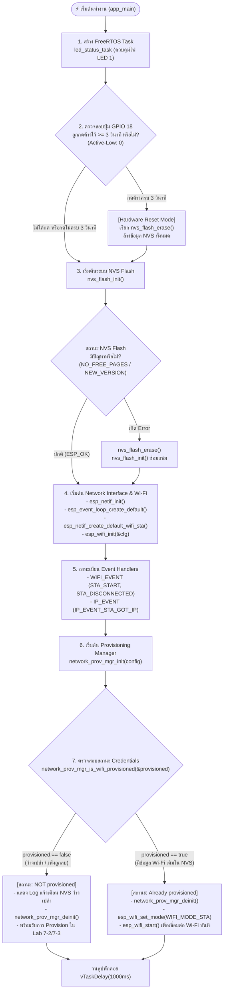
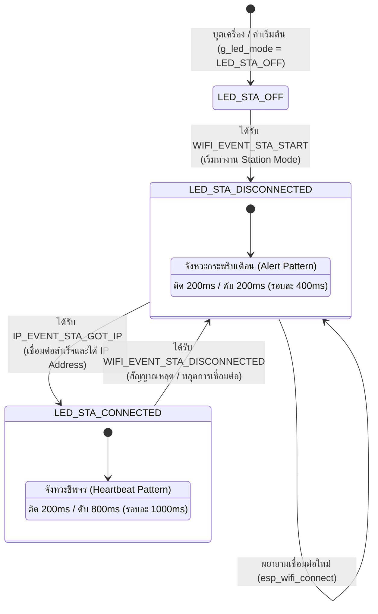
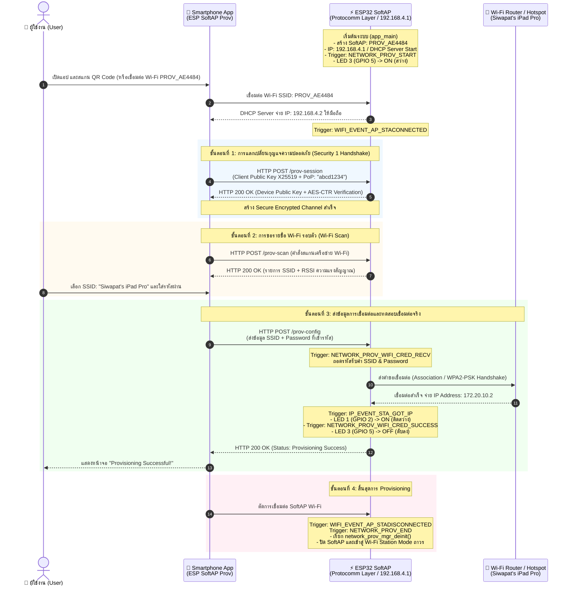
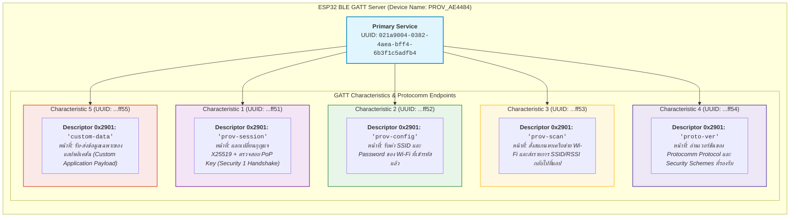
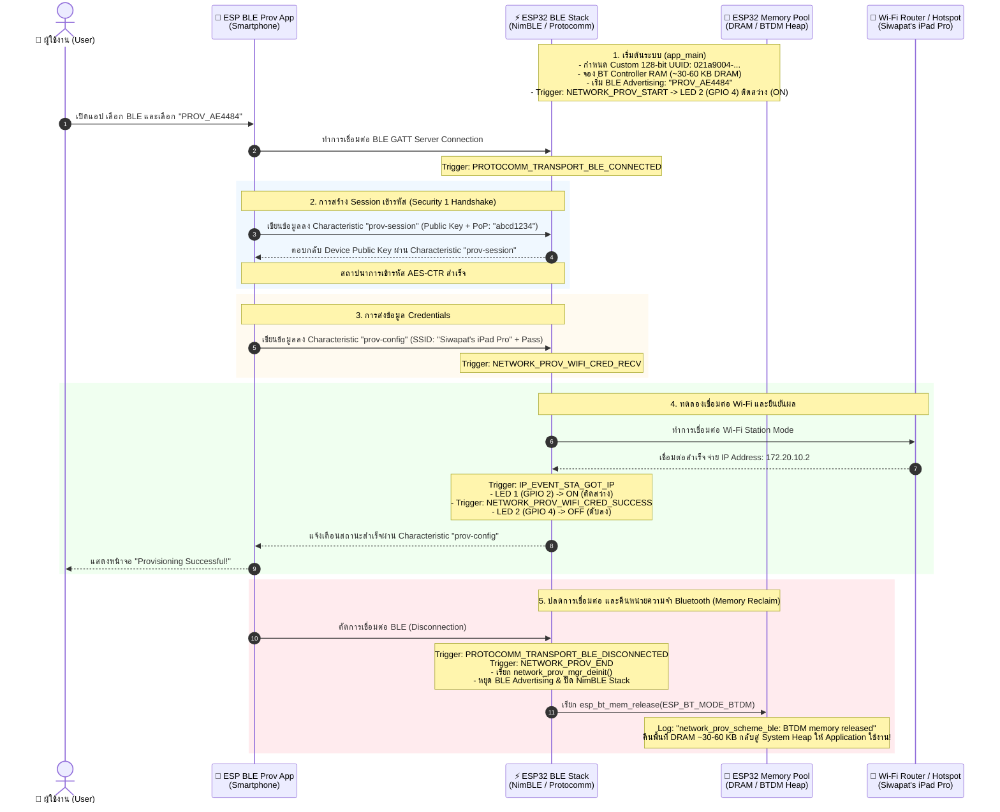
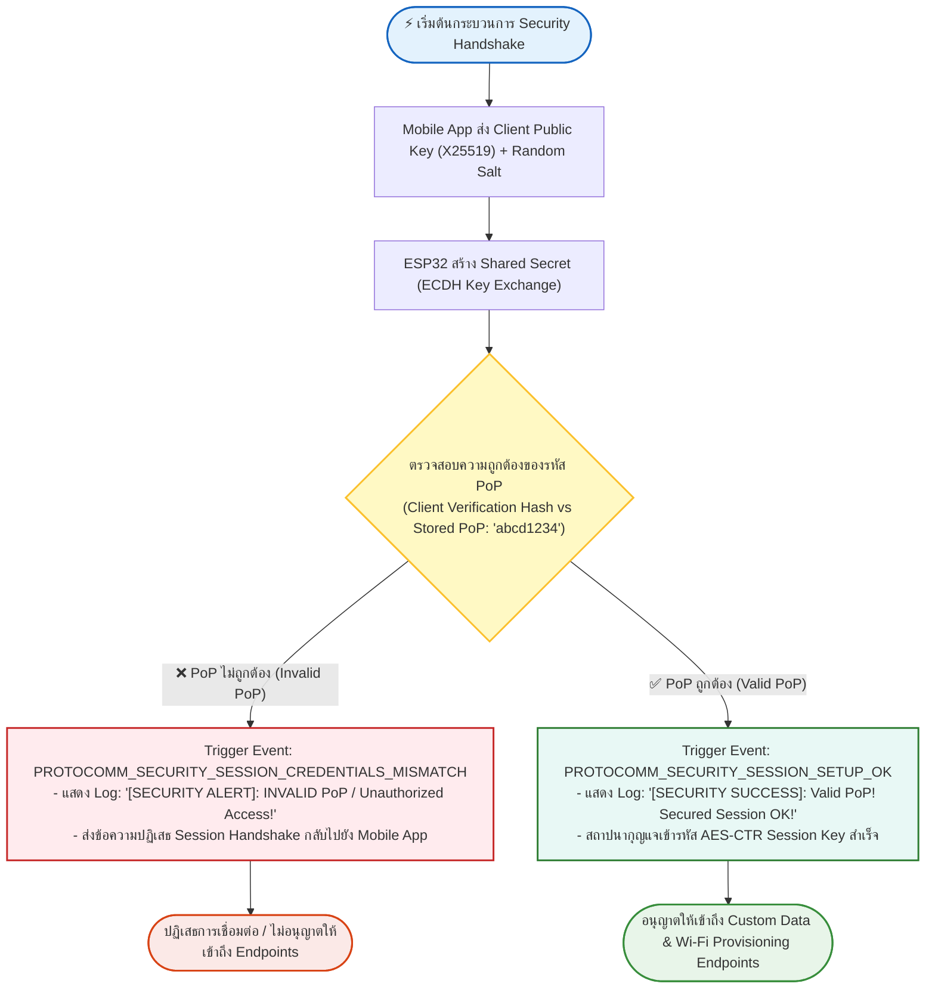
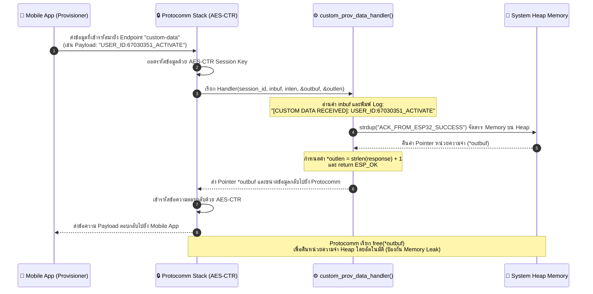
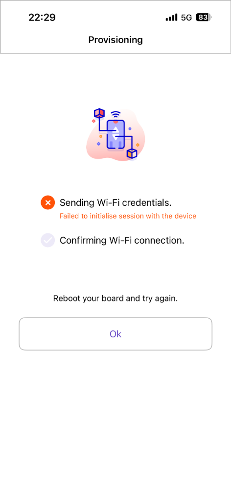
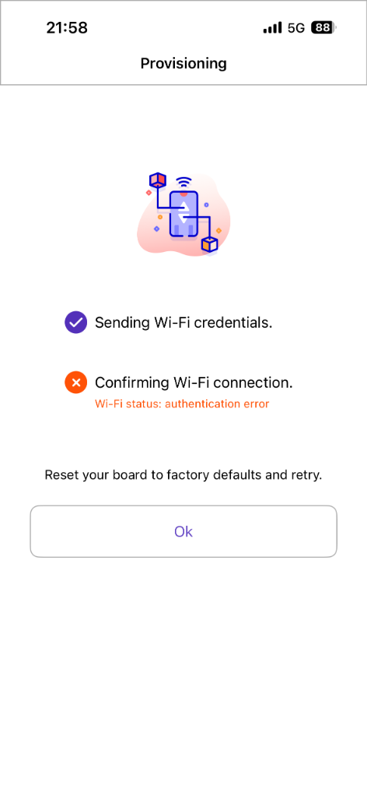
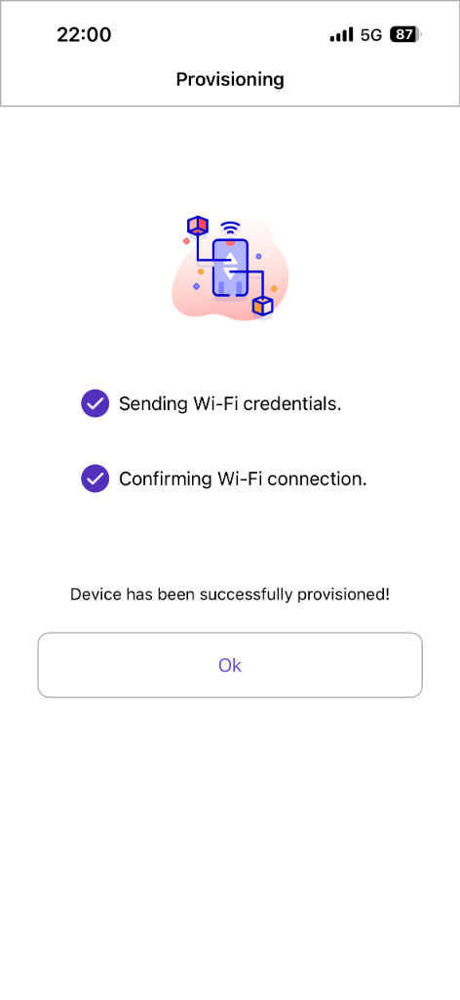

# ใบงานที่ 7.1 การศึกษากลไก Reset Provisioning 3 รูปแบบ และ NVS Memory Forensics
## กิจกรรมถอดรหัสซอร์สโค้ดและเขียนผังงาน (Code Deconstruction & Flowchart Assignment)

ให้นักศึกษาศึกษาโค้ดใน `main/main.c` และ `main/led_indicator.c` แล้วเขียน **ผังงาน (Flowchart / State Diagram)** เพื่ออธิบายการตัดสินใจและการทำงานของระบบ:

### ภารกิจที่ 1  ผังงานการตัดสินใจช่วง Bootstrapping & Reset Decision
ให้นักศึกษาวาด Flowchart แสดงลำดับตรรกะการตรวจสอบเงื่อนไขตั้งแต่เริ่มต้นรันฟังก์ชัน `app_main()` โดยต้องครอบคลุม:
1. การตรวจสอบสถานะปุ่ม **GPIO 18** (ตรวจจับการกดค้าง 3 วินาที)
2. การทำงานของ `nvs_flash_init()` และกรณีที่ต้อง `nvs_flash_erase()`
3. การเรียกฟังก์ชัน `network_prov_mgr_is_wifi_provisioned(&provisioned)`
4. จุดแยกสายการทำงานเข้าสู่โหมด **Provisioning Mode** หรือ **Station Mode**



---

### ภารกิจที่ 2 ผังสถานะการเปลี่ยนจังหวะไฟ LED 1 (Wi-Fi STA Indicator)
ให้นักศึกษาวาด State Diagram แสดงการเปลี่ยนสถานะของ **LED 1 (GPIO 2)**:
- เงื่อนไขใดทำให้ LED 1 เข้าสู่สถานะ `LED_STA_MODE_DISCONNECTED` (กระพริบ 200ms Mark / 200ms Space)
- เงื่อนไขหรือ Event ใดทำให้เปลี่ยนเป็น `LED_STA_MODE_CONNECTED` (Heartbeat 200ms ทุก 1s)


---

## บันทึกผลการทดลอง (Experiment Results)

### บันทึกผลการทดลองจาก Serial Monitor

#### 1. CLI Erase (`idf.py erase-flash`)
```text
I (27) boot: ESP-IDF v6.0.2 2nd stage bootloader
  I (27) boot: compile time Aug 24 2026 09:23:53
  I (28) boot: Multicore bootloader
  I (29) boot: chip revision: v3.1
  I (32) boot.esp32: SPI Speed      : 40MHz
  I (35) boot.esp32: SPI Mode       : DIO
  I (39) boot.esp32: SPI Flash Size : 2MB
  I (42) boot: Enabling RNG early entropy source...
  I (47) boot: Partition Table:
  I (49) boot: ## Label            Usage          Type ST Offset   Length
  I (56) boot:  0 nvs              WiFi data        01 02 00009000 00006000
  I (62) boot:  1 phy_init         RF data          01 01 0000f000 00001000
  I (69) boot:  2 factory          factory app      00 00 00010000 00100000
  I (75) boot: End of partition table
  I (79) esp_image: segment 0: paddr=00010020 vaddr=3f400020 size=1e188h (123272) map
  I (130) esp_image: segment 1: paddr=0002e1b0 vaddr=3ffb0000 size=01e68h (  7784) load
  I (133) esp_image: segment 2: paddr=00030020 vaddr=400d0020 size=98278h (623224) map
  I (356) esp_image: segment 3: paddr=000c82a0 vaddr=3ffb1e68 size=02b34h ( 11060) load
  I (361) esp_image: segment 4: paddr=000caddc vaddr=40080000 size=18104h ( 98564) load
  I (401) esp_image: segment 5: paddr=000e2ee8 vaddr=50000000 size=00028h (    40) load
  I (414) boot: Loaded app from partition at offset 0x10000
  I (414) boot: Disabling RNG early entropy source...
  I (424) cpu_start: Multicore app
  I (432) cpu_start: GPIO 3 and 1 are used as console UART I/O pins
  I (433) cpu_start: Pro cpu start user code
  I (433) cpu_start: cpu freq: 160000000 Hz
  I (434) app_init: Application information:
  I (438) app_init: Project name:     lab7_1_reset_nvs_forensics
  I (444) app_init: App version:      18ddd5a-dirty
  I (448) app_init: Compile time:     Aug 24 2026 09:23:45
  I (453) app_init: ELF file SHA256:  9fab49584...
  I (458) app_init: ESP-IDF:          v6.0.2
  I (461) efuse_init: Min chip rev:     v0.0
  I (465) efuse_init: Max chip rev:     v3.99 
  I (469) efuse_init: Chip rev:         v3.1
  I (473) heap_init: Initializing. RAM available for dynamic allocation:
  I (480) heap_init: At 3FFAE6E0 len 00001920 (6 KiB): DRAM
  I (484) heap_init: At 3FFB8EB0 len 00027150 (156 KiB): DRAM
  I (490) heap_init: At 3FFE0440 len 00003AE0 (14 KiB): D/IRAM
  I (495) heap_init: At 3FFE4350 len 0001BCB0 (111 KiB): D/IRAM
  I (501) heap_init: At 40098104 len 00007EFC (31 KiB): IRAM
  W (507) spi_flash: Detected boya flash chip but using generic driver. For optimal functionality, enable `SPI_FLASH_SUPPORT_BOYA_CHIP` in menuconfig
  I (519) spi_flash: detected chip: generic
  I (522) spi_flash: flash io: dio
  W (525) spi_flash: Detected size(4096k) larger than the size in the binary image header(2048k). Using the size in the binary image header.
  I (539) main_task: Started on CPU0
  I (539) main_task: Calling app_main()
  I (539) LAB7_1_RESET: Hold GPIO 18 button for 3 seconds to trigger Factory Reset...
  I (549) nvs: NVS partition "nvs" is empty, formatting...
  I (619) nvs: Formatting finished, 6 free sectors
  I (629) wifi:wifi driver task: 3ffc1a8c, prio:23, stack:6656, core=0
  I (629) wifi:wifi firmware version: 00ad238
  I (629) wifi:wifi certification version: v7.0
  I (629) wifi:config NVS flash: enabled
  I (629) wifi:config nano formatting: disabled
  I (639) wifi:Init data frame dynamic rx buffer num: 32
  I (639) wifi:Init static rx mgmt buffer num: 5
  I (649) wifi:Init management short buffer num: 32
  I (649) wifi:Init dynamic tx buffer num: 32
  I (649) wifi:Init static rx buffer size: 1600
  I (659) wifi:Init static rx buffer num: 10
  I (659) wifi:Init dynamic rx buffer num: 32
  I (669) wifi_init: rx ba win: 6
  I (669) wifi_init: accept mbox: 6
  I (669) wifi_init: tcpip mbox: 32
  I (679) wifi_init: udp mbox: 6
  I (679) wifi_init: tcp mbox: 6
  I (679) wifi_init: tcp tx win: 5760
  I (679) wifi_init: tcp rx win: 5760
  I (689) wifi_init: tcp mss: 1440
  I (689) wifi_init: WiFi IRAM OP enabled
  I (689) wifi_init: WiFi RX IRAM OP enabled
  W (699) LAB7_1_RESET: --------------------------------------------------
  W (709) LAB7_1_RESET: [STATUS]: Device is NOT provisioned (NVS is empty)
  W (709) LAB7_1_RESET: Ready for Provisioning Lab 7-2 (SoftAP) or 7-3 (BLE)!
  W (719) LAB7_1_RESET: --------------------------------------------------
  ```

---

#### 2. Hardware Button (GPIO 18)
```text
I (27) boot: ESP-IDF v6.0.2 2nd stage bootloader
  I (27) boot: compile time Aug 24 2026 09:23:53
  I (28) boot: Multicore bootloader
  I (29) boot: chip revision: v3.1
  I (32) boot.esp32: SPI Speed      : 40MHz
  I (35) boot.esp32: SPI Mode       : DIO
  I (39) boot.esp32: SPI Flash Size : 2MB
  I (42) boot: Enabling RNG early entropy source...
  I (47) boot: Partition Table:
  I (49) boot: ## Label            Usage          Type ST Offset   Length
  I (56) boot:  0 nvs              WiFi data        01 02 00009000 00006000
  I (62) boot:  1 phy_init         RF data          01 01 0000f000 00001000
  I (69) boot:  2 factory          factory app      00 00 00010000 00100000
  I (75) boot: End of partition table
  I (79) esp_image: segment 0: paddr=00010020 vaddr=3f400020 size=1e188h (123272) map
  I (130) esp_image: segment 1: paddr=0002e1b0 vaddr=3ffb0000 size=01e68h (  7784) load
  I (133) esp_image: segment 2: paddr=00030020 vaddr=400d0020 size=98278h (623224) map
  I (356) esp_image: segment 3: paddr=000c82a0 vaddr=3ffb1e68 size=02b34h ( 11060) load
  I (361) esp_image: segment 4: paddr=000caddc vaddr=40080000 size=18104h ( 98564) load
  I (401) esp_image: segment 5: paddr=000e2ee8 vaddr=50000000 size=00028h (    40) load
  I (414) boot: Loaded app from partition at offset 0x10000
  I (414) boot: Disabling RNG early entropy source...
  I (424) cpu_start: Multicore app
  I (432) cpu_start: GPIO 3 and 1 are used as console UART I/O pins
  I (433) cpu_start: Pro cpu start user code
  I (433) cpu_start: cpu freq: 160000000 Hz
  I (434) app_init: Application information:
  I (438) app_init: Project name:     lab7_1_reset_nvs_forensics
  I (444) app_init: App version:      18ddd5a-dirty
  I (448) app_init: Compile time:     Aug 24 2026 09:23:45
  I (453) app_init: ELF file SHA256:  9fab49584...
  I (458) app_init: ESP-IDF:          v6.0.2
  I (461) efuse_init: Min chip rev:     v0.0
  I (465) efuse_init: Max chip rev:     v3.99 
  I (469) efuse_init: Chip rev:         v3.1
  I (473) heap_init: Initializing. RAM available for dynamic allocation:
  I (480) heap_init: At 3FFAE6E0 len 00001920 (6 KiB): DRAM
  I (484) heap_init: At 3FFB8EB0 len 00027150 (156 KiB): DRAM
  I (490) heap_init: At 3FFE0440 len 00003AE0 (14 KiB): D/IRAM
  I (495) heap_init: At 3FFE4350 len 0001BCB0 (111 KiB): D/IRAM
  I (501) heap_init: At 40098104 len 00007EFC (31 KiB): IRAM
  W (507) spi_flash: Detected boya flash chip but using generic driver. For optimal functionality, enable `SPI_FLASH_SUPPORT_BOYA_CHIP` in menuconfig
  I (519) spi_flash: detected chip: generic
  I (522) spi_flash: flash io: dio
  W (525) spi_flash: Detected size(4096k) larger than the size in the binary image header(2048k). Using the size in the binary image header.
  I (539) main_task: Started on CPU0
  I (539) main_task: Calling app_main()
  I (539) LAB7_1_RESET: Hold GPIO 18 button for 3 seconds to trigger Factory Reset...
  I (1549) LAB7_1_RESET: Holding button... 1/3 seconds
  I (2549) LAB7_1_RESET: Holding button... 2/3 seconds
  I (3549) LAB7_1_RESET: Holding button... 3/3 seconds
  W (3549) LAB7_1_RESET: =================================================
  W (3549) LAB7_1_RESET: >>> FACTORY RESET TRIGGERED! ERASING NVS FLASH <<<
  W (3549) LAB7_1_RESET: =================================================
  W (3559) LAB7_1_RESET: [FORENSIC]: User requested Flash Erase!
  I (3789) wifi:wifi driver task: 3ffc1a8c, prio:23, stack:6656, core=0
  I (3789) wifi:wifi firmware version: 00ad238
  I (3789) wifi:wifi certification version: v7.0
  I (3789) wifi:config NVS flash: enabled
  I (3789) wifi:config nano formatting: disabled
  I (3799) wifi:Init data frame dynamic rx buffer num: 32
  I (3799) wifi:Init static rx mgmt buffer num: 5
  I (3809) wifi:Init management short buffer num: 32
  I (3809) wifi:Init dynamic tx buffer num: 32
  I (3809) wifi:Init static rx buffer size: 1600
  I (3819) wifi:Init static rx buffer num: 10
  I (3819) wifi:Init dynamic rx buffer num: 32
  I (3829) wifi_init: rx ba win: 6
  I (3829) wifi_init: accept mbox: 6
  I (3829) wifi_init: tcpip mbox: 32
  I (3839) wifi_init: udp mbox: 6
  I (3839) wifi_init: tcp mbox: 6
  I (3839) wifi_init: tcp tx win: 5760
  I (3839) wifi_init: tcp rx win: 5760
  I (3849) wifi_init: tcp mss: 1440
  I (3849) wifi_init: WiFi IRAM OP enabled
  I (3849) wifi_init: WiFi RX IRAM OP enabled
  W (3859) LAB7_1_RESET: --------------------------------------------------
  W (3869) LAB7_1_RESET: [STATUS]: Device is NOT provisioned (NVS is empty)
  W (3869) LAB7_1_RESET: Ready for Provisioning Lab 7-2 (SoftAP) or 7-3 (BLE)!
  W (3879) LAB7_1_RESET: --------------------------------------------------
  ```

---

### ตารางบันทึกผลการทดลอง (Experiment Results)

| รูปแบบการ Reset | คำสั่ง / พฤติกรรมที่ทำ | พฤติกรรมของ LED แต่ละดวงหลังเปิดเครื่อง | สถานะใน Serial Monitor |
| :--- | :--- | :--- | :--- |
| **1. CLI Erase** | `idf.py erase-flash` | **LED 1 (GPIO 2):** ดับสนิท (`LED_STA_OFF`) เนื่องจากยังไม่มี Credentials และระบบยังไม่เข้าสู่โหมดเชื่อมต่อ Station | แสดงขั้นตอน Chip Erase สำเร็จ เมื่อแฟลชโค้ดใหม่ NVS ถูก Format ใหม่ และขึ้น `[STATUS]: Device is NOT provisioned (NVS is empty)` |
| **2. Hardware Button (GPIO 18)** | กดปุ่ม GPIO 18 ค้าง 3 วินาที | **LED 1 (GPIO 2):** ดับสนิท (`LED_STA_OFF`) ขณะตรวจจับปุ่ม และคงสถานะดับหลังสั่ง Flash Erase | ตรวจพบปุ่ม Active-Low นับ 1/3, 2/3, 3/3 วิ $\rightarrow$ `>>> FACTORY RESET TRIGGERED! ERASING NVS FLASH <<<` $\rightarrow$ `[STATUS]: Device is NOT provisioned` |

---

## คำถามท้ายการทดลอง (Post-Lab Questions)

### ข้อที่ 1: เพราะเหตุใดการกดปุ่ม BOOT (GPIO 0) ค้างไว้ในจังหวะรีเซ็ตบอร์ด จึงทำให้โปรแกรมค้างอยู่ที่ ROM Bootloader และไม่ยอมทำงานต่อ?
**คำตอบ:**
ขา **GPIO 0** ของ ESP32 ถูกกำหนดหน้าที่ทางฮาร์ดแวร์ให้เป็น **Strapping Pin** สำหรับเลือกโหมดการบูตของชิป (Boot Mode Selection):
- ในขณะที่บอร์ดถูกจ่ายไฟหรือกดปุ่ม Reset วงจรภายในชิปจะทำการอ่านค่าระดับแรงดันที่ขา GPIO 0 (Sampling Strapping Pin)
- หากขา GPIO 0 มีสถานะเป็น **`LOW (0)`** ตัวฮาร์ดแวร์จะสลับเข้าสู่โหมด **ROM Download Bootloader (UART Bootloader)** ทันที เพื่อรอรับการดาวน์โหลดไฟล์เฟิร์มแวร์ผ่านพอร์ต Serial UART
- ด้วยเหตุนี้ ตัวประมวลผลจึงหยุดรอคำสั่งแฟลชโปรแกรม และไม่ยอมกระโดดข้ามไปรัน 2nd Stage Bootloader หรือโค้ดในฟังก์ชัน `app_main()` บน SPI Flash
- ดังนั้น ในการออกแบบปุ่ม Factory Reset บนอุปกรณ์เชิงพาณิชย์ จึงต้องหลีกเลี่ยงการใช้ Strapping Pin (GPIO 0, 2, 12, 15) และเปลี่ยนไปใช้ขา GPIO ทั่วไป เช่น **GPIO 18** แทน

---

### ข้อที่ 2: เพราะเหตุใดคำสั่ง `idf.py erase-flash` จึงทำให้ข้อมูลเฟิร์มแวร์ Application หายไปด้วย ในขณะที่ `nvs_flash_erase()` ไม่ทำให้เฟิร์มแวร์หาย?
**คำตอบ:**
เกิดจากความแตกต่างของ **ขอบเขตพื้นที่หน่วยความจำที่ถูกสั่งลบ (Memory Erase Scope)**:
1. **`idf.py erase-flash` (Chip Erase):**
   เป็นคำสั่งระดับฮาร์ดแวร์ที่ส่งผ่าน `esptool` ไปยังชิป SPI Flash เพื่อสั่งลบทุก Sector ตั้งแต่ Offset `0x00000000` ไปจนถึงจุดสิ้นสุดของชิป Flash (ขนาด 2MB, 4MB หรือ 8MB) ซึ่งรวมถึงพื้นที่ของ 2nd Stage Bootloader (`0x1000`), Partition Table (`0x8000`), NVS Partition (`0x9000`) และ Factory Application Code (`0x10000`) ข้อมูลทั้งหมดจะถูกเปลี่ยนเป็น `0xFF` เฟิร์มแวร์จึงหายทั้งหมด
2. **`nvs_flash_erase()` (Partition-Specific Erase):**
   เป็น Software API ภายใน ESP-IDF ที่ทำงานโดยอ้างอิงตำแหน่ง Partition Table ใน Flash โดยจะส่งคำสั่ง Sector Erase เฉพาะ Sector ที่อยู่ในขอบเขตของ Partition ที่มีชื่อว่า `"nvs"` เท่านั้น (Offset `0x00009000` ขนาด `0x00006000` หรือ 24 KB) โดยไม่ไปยุ่งเกี่ยวกับพื้นที่ของ Application Partition (`factory` ที่ Offset `0x10000`) เฟิร์มแวร์จึงยังคงอยู่ครบถ้วนและทำงานต่อได้ตามปกติ

---

### ข้อที่ 3: การออกแบบปุ่ม Factory Reset บนอุปกรณ์ IoT เชิงพาณิชย์ เหตุใดจึงต้องกำหนดให้ผู้ใช้กดปุ่มค้างไว้ 3-5 วินาที แทนที่จะสั่งลบข้อมูลทันทีที่แตะปุ่มเพียงเสี้ยววินาที?
**คำตอบ:**
มีเหตุผลสำคัญด้านความปลอดภัยและการออกแบบประสบการณ์ผู้ใช้ (UX / Reliability):
1. **ป้องกันการกดโดนโดยไม่ตั้งใจ (Accidental Trigger):** การล้างค่า Factory Reset ทำให้ข้อมูลการตั้งค่า Credentials และการเชื่อมต่อ Cloud สูญหาย หากแตะปุ่มแล้วลบทันที การเผลอมือไปโดนหรือการเคลื่อนย้ายอุปกรณ์อาจทำให้ระบบหลุดจากการทำงานทันที
2. **กรองสัญญาณรบกวนทางไฟฟ้า (Switch Debouncing & Glitch Filtering):** สวิตช์ปุ่มกดเชิงกลอาจเกิดปรากฏการณ์ Contact Bounce หรือมีสัญญาณรบกวนชั่วครู่ (Transient Noise) การตั้งเงื่อนไขเวลากดค้าง 3-5 วินาที เป็นการทำ Software Debounce และยืนยันระดับสัญญาณลอจิกที่เสถียร
3. **การยืนยันเจตนาของผู้ใช้ (Intentional Action Confirmation):** เป็นมาตรฐานสากลด้าน Human-Machine Interface (HMI) ที่ต้องการให้ผู้ใช้ตระหนักและตั้งใจทำการรีเซ็ตระบบอย่างแท้จริง

---

### ข้อที่ 4: หากอุปกรณ์ IoT ถูกติดตั้งอยู่บนเสาสูงหรือฝังอยู่ในผนัง วิธีการ Reset ทางกายภาพรูปแบบใดเหมาะสมที่สุด?
**คำตอบ:**
สำหรับอุปกรณ์ที่ไม่สะดวกในการเข้าถึงปุ่มกดทางกายภาพโดยตรง มีแนวทางที่เหมาะสมดังนี้:
1. **การรีเซ็ตผ่านวงจรจ่ายไฟ (Power-Cycling Sequence Reset):**
   ใช้วิธีเปิด-ปิดสวิตช์เบรกเกอร์หรือสวิตช์ไฟหลักตามลำดับจังหวะที่กำหนด เช่น ปิด-เปิดติดต่อกัน 5 ครั้ง (ภายใน 10 วินาที) เฟิร์มแวร์จะนับจำนวนครั้งการบูตผ่าน RTC Memory หรือ NVS หากครบเงื่อนไขจะสั่ง Factory Reset ทันที (เป็นวิธีมาตรฐานที่ใช้ใน Smart Bulb, Smart Switch ของ Tuya/Sonoff)
2. **การสั่งรีเซ็ตผ่านเครือข่ายระยะไกล (In-Band Remote Reset / Cloud Command):**
   ส่งคำสั่งผ่าน MQTT Topic, CoAP หรือ REST API จาก Cloud Dashboard หรือ Mobile App โดยมีระบบยืนยันตัวตน (Authentication & Token)
3. **การใช้สวิตช์แม่เหล็ก (Magnetic Reed Switch / Hall Effect Sensor):**
   ติดตั้งเซนเซอร์ตรวจจับแม่เหล็กไว้ภายในตัวอุปกรณ์ เมื่อต้องการรีเซ็ต เพียงนำแท่งแม่เหล็กแรงสูงไปทาบที่บริเวณผนังด้านนอกตรงตำแหน่งเซนเซอร์ค้างไว้ 3-5 วินาที โดยไม่ต้องรื้อผนังหรือปีนขึ้นไปเปิดกล่องอุปกรณ์

# ใบงานที่ 7.2 การคอนฟิก Wi-Fi ผ่าน SoftAP Scheme และการวิเคราะห์ Protocomm Endpoints

---

## 1. กิจกรรมถอดรหัสซอร์สโค้ดและเขียนผังงาน (Code Deconstruction & Sequence Flow Assignment)

### ภารกิจที่ 1: ผังลำดับการสื่อสารผ่าน HTTP Endpoints (SoftAP Scheme Sequence Flow)
แผนภาพลำดับเหตุการณ์ (Sequence Diagram) แสดงปฏิสัมพันธ์ระหว่าง 3 ฝ่าย ได้แก่ Smartphone App (ESP SoftAP Prov), ESP32 Webserver (Protocomm Layer บน SoftAP), และ Wi-Fi Router (AP ปลายทาง)



---

## 2. ตารางบันทึกผลการทดลอง (Experiment Results)

| รายการตรวจสอบ | ค่าที่บันทึกได้จากการทดลองจริง |
| :--- | :--- |
| **1. ชื่อ SoftAP SSID ของ ESP32** | `PROV_AE4484` *(มาจาก MAC Address `88:57:21:AE:44:84`)* |
| **2. รหัส PoP (Proof of Possession)** | `abcd1234` |
| **3. ข้อความใน QR Code Payload (JSON)** | `{"ver":"v1","name":"PROV_AE4484","pop":"abcd1234","transport":"softap"}` |
| **4. พฤติกรรมไฟ LED แต่ละดวง** | **LED 3 (GPIO 5 / SoftAP Prov):** ช่วงรอต่อ SoftAP ติดสว่าง (`1`) และดับลง (`0`) เมื่อ Provision สำเร็จ<br/>**LED 1 (GPIO 2 / On-board LED):** ดับในช่วงแรก และติดสว่างค้างเมื่อเชื่อมต่อ Wi-Fi และได้รับ IP สำเร็จ |
| **5. IP Address ที่ ESP32 ได้รับจาก Router** | `172.20.10.2` *(Subnet Mask: `255.255.255.240`, Gateway: `172.20.10.1`)* |
| **6. เวลาที่ใช้ตั้งแต่เริ่มจนจบกระบวนการ (วินาที)** | ประมาณ **50.5 วินาที** *(ตั้งแต่เริ่มเปิด SoftAP ที่ `669ms` จนจบที่ `51159ms`)* |

---

### บันทึก Serial Monitor Log จากการทดลองจริง (ESP-IDF v6.0.2 Log)
```text
I (27) boot: ESP-IDF v6.0.2 2nd stage bootloader
I (27) boot: compile time Aug 24 2026 10:42:41
I (28) boot: Multicore bootloader
I (29) boot: chip revision: v3.1
I (32) boot.esp32: SPI Speed      : 40MHz
I (35) boot.esp32: SPI Mode       : DIO
I (39) boot.esp32: SPI Flash Size : 2MB
I (42) boot: Enabling RNG early entropy source...
I (47) boot: Partition Table:
I (49) boot: ## Label            Usage          Type ST Offset   Length
I (56) boot:  0 nvs              WiFi data        01 02 00009000 00006000
I (62) boot:  1 phy_init         RF data          01 01 0000f000 00001000
I (69) boot:  2 factory          factory app      00 00 00010000 00100000
I (75) boot: End of partition table
I (79) esp_image: segment 0: paddr=00010020 vaddr=3f400020 size=25d30h (154928) map
I (141) esp_image: segment 1: paddr=00035d58 vaddr=3ffb0000 size=049b0h ( 18864) load
I (149) esp_image: segment 2: paddr=0003a710 vaddr=40080000 size=05908h ( 22792) load
I (159) esp_image: segment 3: paddr=00040020 vaddr=400d0020 size=a5650h (677456) map
I (400) esp_image: segment 4: paddr=000e5678 vaddr=40085908 size=128d0h ( 75984) load
I (432) esp_image: segment 5: paddr=000f7f50 vaddr=50000000 size=00028h (    40) load
I (444) boot: Loaded app from partition at offset 0x10000
I (444) boot: Disabling RNG early entropy source...
I (455) cpu_start: Multicore app
I (463) cpu_start: GPIO 3 and 1 are used as console UART I/O pins
I (463) cpu_start: Pro cpu start user code
I (463) cpu_start: cpu freq: 160000000 Hz
I (465) app_init: Application information:
I (469) app_init: Project name:     lab7_2_softap_provisioning
I (474) app_init: App version:      1a00eea-dirty
I (479) app_init: Compile time:     Aug 24 2026 10:42:37
I (484) app_init: ELF file SHA256:  c1532e661...
I (488) app_init: ESP-IDF:          v6.0.2
I (492) efuse_init: Min chip rev:     v0.0
I (496) efuse_init: Max chip rev:     v3.99 
I (500) efuse_init: Chip rev:         v3.1
I (504) heap_init: Initializing. RAM available for dynamic allocation:
I (510) heap_init: At 3FFAE6E0 len 00001920 (6 KiB): DRAM
I (515) heap_init: At 3FFB8EC8 len 00027138 (156 KiB): DRAM
I (520) heap_init: At 3FFE0440 len 00003AE0 (14 KiB): D/IRAM
I (526) heap_init: At 3FFE4350 len 0001BCB0 (111 KiB): D/IRAM
I (531) heap_init: At 400981D8 len 00007E28 (31 KiB): IRAM
W (538) spi_flash: Detected boya flash chip but using generic driver. For optimal functionality, enable `SPI_FLASH_SUPPORT_BOYA_CHIP` in menuconfig
I (549) spi_flash: detected chip: generic
I (553) spi_flash: flash io: dio
W (556) spi_flash: Detected size(4096k) larger than the size in the binary image header(2048k). Using the size in the binary image header.
I (569) main_task: Started on CPU0
I (569) main_task: Calling app_main()
I (599) wifi:wifi driver task: 3ffc1420, prio:23, stack:6656, core=0
I (599) wifi:wifi firmware version: 00ad238
I (599) wifi:wifi certification version: v7.0
I (599) wifi:config NVS flash: enabled
I (599) wifi:config nano formatting: disabled
I (609) wifi:Init data frame dynamic rx buffer num: 32
I (609) wifi:Init static rx mgmt buffer num: 5
I (619) wifi:Init management short buffer num: 32
I (619) wifi:Init dynamic tx buffer num: 32
I (619) wifi:Init static rx buffer size: 1600
I (629) wifi:Init static rx buffer num: 10
I (629) wifi:Init dynamic rx buffer num: 32
I (639) wifi_init: rx ba win: 6
I (639) wifi_init: accept mbox: 6
I (639) wifi_init: tcpip mbox: 32
I (639) wifi_init: udp mbox: 6
I (649) wifi_init: tcp mbox: 6
I (649) wifi_init: tcp tx win: 5760
I (649) wifi_init: tcp rx win: 5760
I (659) wifi_init: tcp mss: 1440
I (659) wifi_init: WiFi IRAM OP enabled
I (659) wifi_init: WiFi RX IRAM OP enabled
I (669) LAB7_2_SOFTAP: Starting SoftAP Provisioning (SSID: PROV_AE4484, PoP: abcd1234)
I (679) phy_init: phy_version 4863,a3a4459,Oct 28 2025,14:30:06
W (679) phy_init: failed to load RF calibration data (0x1102), falling back to full calibration
I (759) phy_init: Saving new calibration data due to checksum failure or outdated calibration data, mode(2)
I (779) wifi:mode : sta (88:57:21:ae:44:84)
I (779) wifi:enable tsf
I (789) wifi:mode : sta (88:57:21:ae:44:84) + softAP (88:57:21:ae:44:85)
I (789) wifi:Total power save buffer number: 16
I (789) wifi:Init max length of beacon: 752/752
I (789) wifi:Init max length of beacon: 752/752
I (799) esp_netif_lwip: DHCP server started on interface WIFI_AP_DEF with IP: 192.168.4.1
I (799) wifi:Total power save buffer number: 16
I (809) esp_netif_lwip: DHCP server started on interface WIFI_AP_DEF with IP: 192.168.4.1
I (819) network_prov_mgr: Provisioning started with service name : PROV_AE4484 
I (829) LAB7_2_SOFTAP: [PROV EVENT]: SoftAP Provisioning Started!
I (829) LAB7_2_SOFTAP: --------------------------------------------------
I (839) LAB7_2_SOFTAP: [QR CODE URL]: Click or copy the URL below:
I (839) LAB7_2_SOFTAP: https://espressif.github.io/esp-jumpstart/qrcode.html?data=%7B%22ver%22%3A%22v1%22%2C%22name%22%3A%22PROV_AE4484%22%2C%22pop%22%3A%22abcd1234%22%2C%22transport%22%3A%22softap%22%7D
I (859) LAB7_2_SOFTAP: Payload JSON: {"ver":"v1","name":"PROV_AE4484","pop":"abcd1234","transport":"softap"}
I (869) LAB7_2_SOFTAP: --------------------------------------------------
I (879) main_task: Returned from app_main()
I (13449) wifi:new:<1,0>, old:<1,1>, ap:<1,0>, sta:<0,0>, prof:1, snd_ch_cfg:0x0
I (13449) wifi:station: fa:4c:db:b8:d1:e5 join, AID=1, bgn, 20
I (13449) LAB7_2_SOFTAP: [SOFTAP]: Mobile Phone connected to ESP32 SoftAP!
I (13569) esp_netif_lwip: DHCP server assigned IP to a client, IP is: 192.168.4.2
I (14009) wifi:<ba-add>idx:2 (ifx:1, fa:4c:db:b8:d1:e5), tid:0, ssn:0, winSize:64
I (19339) security1: ad a0 83 c5 bd 94 b3 16 c2 43 bf 91 26 76 31 a4
I (19339) security1: 08 fc 02 ea 69 5a 56 d0 1b 37 82 0d fb 94 30 2b
I (19339) security1: 6b eb 99 16 d8 de c8 96 d3 5b 68 96 82 cf 68 58
I (19349) security1: 5a f1 47 05 89 5c 6d 66 53 54 87 ca 7e 03 42 50
I (19619) security1: 95 1f d0 a9 08 69 0e 54 16 bf aa ed 8c 7a 34 ce
I (19619) security1: 15 e0 e3 4d b9 67 5a a4 7e 82 75 5b 36 7d 5d 9e
I (19629) security1: ea fe d7 c1 3d 1b 6f fc 37 e2 22 65 bd f9 9d de
I (19659) security1: a6 9a 78 57 f3 e3 3b 1b 62 91 7f f5 98 12 5b 78
I (19659) security1: 7a 54 54 74 3b 49 e6 4e 5a cc df 1e 4c 2c ff 9c
I (19659) security1: ad a0 83 c5 bd 94 b3 16 c2 43 bf 91 26 76 31 a4
I (19669) security1: 08 fc 02 ea 69 5a 56 d0 1b 37 82 0d fb 94 30 2b
I (19669) security1: 83 63 b9 6e 07 d7 cc 6e 54 0a 37 a2 9b cf fd 62
I (19679) security1: cc 2d 0f a5 d7 69 3b 59 ed 98 1c 3b a1 15 a6 38
W (37599) wifi:Password length matches WPA2 standards, authmode threshold changes from OPEN to WPA2
I (37629) LAB7_2_SOFTAP: =================================================
I (37629) LAB7_2_SOFTAP: [CREDENTIALS RECEIVED]:
I (37629) LAB7_2_SOFTAP:   -> Target SSID     : Siwapat's iPad Pro
I (37639) LAB7_2_SOFTAP:   -> Target Password : **********
I (37639) LAB7_2_SOFTAP: =================================================
I (41739) wifi:primary chan differ, old=1, new=6, start CSA timer
I (42169) wifi:switch to channel 6
I (42169) wifi:ap channel adjust o:1,0 n:6,0
I (42169) wifi:new:<6,0>, old:<1,0>, ap:<6,0>, sta:<0,0>, prof:1, snd_ch_cfg:0x0
I (42179) wifi:state: init -> auth (0xb0)
I (42189) wifi:state: auth -> assoc (0x0)
I (42199) wifi:state: assoc -> run (0x10)
I (42279) wifi:connected with Siwapat's iPad Pro, aid = 1, channel 6, BW20, bssid = 0e:c9:2f:74:0b:5b
I (42279) wifi:security: WPA2-PSK, phy: bgn, rssi: -55, cipher(pairwise:0x3, group:0x3), pmf:0
I (42299) wifi:pm start, type: 1

I (42299) wifi:dp: 1, bi: 102400, li: 3, scale listen interval from 307200 us to 307200 us
I (42419) wifi:AP's beacon interval = 102400 us, DTIM period = 1
I (43539) LAB7_2_SOFTAP: =================================================
I (43539) LAB7_2_SOFTAP: [ONLINE]: Got IP: 172.20.10.2
I (43539) LAB7_2_SOFTAP: =================================================
I (43539) esp_netif_handlers: sta ip: 172.20.10.2, mask: 255.255.255.240, gw: 172.20.10.1
I (43549) network_prov_mgr: STA Got IP
I (43549) LAB7_2_SOFTAP: [SUCCESS]: Provisioning Completed Successfully!
W (48429) LAB7_2_SOFTAP: [SOFTAP]: Mobile Phone disconnected from ESP32 SoftAP
I (48429) wifi:<ba-del>idx:2, tid:0
I (48429) wifi:station: fa:4c:db:b8:d1:e5 join, AID=1, bgn, 20
I (48429) LAB7_2_SOFTAP: [SOFTAP]: Mobile Phone connected to ESP32 SoftAP!
I (50029) wifi:<ba-add>idx:2 (ifx:1, fa:4c:db:b8:d1:e5), tid:0, ssn:97, winSize:64
I (51149) wifi:station: fa:4c:db:b8:d1:e5 leave, AID = 1, reason = 2, bss_flags is 33721443, bss:0x3ffba800
I (51149) wifi:<ba-del>idx:2, tid:0
I (51149) wifi:mode : sta (88:57:21:ae:44:84)
I (51159) network_prov_mgr: Provisioning stopped
W (51159) LAB7_2_SOFTAP: [SOFTAP]: Mobile Phone disconnected from ESP32 SoftAP
I (51159) LAB7_2_SOFTAP: [PROV EVENT]: De-initializing Provisioning Manager
```

---

## 3. คำถามท้ายการทดลอง (Post-Lab Questions)

### ข้อที่ 1: ในโหมด SoftAP Scheme สมาร์ตโฟนส่งข้อมูลหา ESP32 ผ่านโปรโตคอลและ IP Address ใด?
**คำตอบ:**
- **โปรโตคอลในการส่งข้อมูล:** ใช้โปรโตคอล **HTTP (REST-like POST Requests)** ผ่านพอร์ต **`80`** โดยมีเฟรมเวิร์ก **Protocomm** ซ้อนอยู่บน Application Layer ซึ่งเข้ารหัสข้อมูลด้วย **X25519 (Key Exchange) + AES-CTR (Data Encryption) + PoP Authentication (Security 1)**
- **IP Address ของ ESP32:** คือ **`192.168.4.1`** (ซึ่งเป็น Default Gateway และ Webserver ของวงเครือข่าย SoftAP ที่ ESP32 สร้างขึ้น)
- **IP Address ของสมาร์ตโฟน:** ได้รับการแจกจ่ายจาก DHCP Server ของ ESP32 คือ **`192.168.4.2`**

---

### ข้อที่ 2: หากผู้ใช้ป้อนรหัสผ่าน Wi-Fi ผิดในแอปมือถือ จะเกิด Event ใดขึ้นบน ESP32 (`NETWORK_PROV_WIFI_CRED_FAIL`) และ ESP32 มีพฤติกรรมอย่างไร?
**คำตอบ:**
- **Event ที่เกิดขึ้น:** จะเกิด Event **`NETWORK_PROV_WIFI_CRED_FAIL`** (หรือ `WIFI_PROV_CRED_FAIL` ใน IDF รุ่นก่อนหน้า)
- **พฤติกรรมของ ESP32:**
  1. โปรแกรมจะแจ้งเตือนใน Log: `[ERROR]: Wi-Fi Connection failed with provided credentials!`
  2. ESP32 จะส่งข้อความตอบกลับสถานะข้อผิดพลาดผ่าน HTTP Response ไปยังแอปพลิเคชันบนสมาร์ตโฟน เพื่อแจ้งให้ผู้ใช้ทราบว่ารหัสผ่านไม่ถูกต้อง (Authentication Failed)
  3. **ESP32 จะยังคงเปิดสัญญาณ SoftAP (`PROV_XXXXXX`) ค้างไว้ต่อไป** และ State Machine จะรีเซ็ตกลับมารอรับการใส่รหัสผ่านใหม่จากแอปอีกครั้ง โดยไม่ปิดการทำงานและไม่ทำให้ระบบหยุดทำงาน (Reboot/Crash)

---

### ข้อที่ 3: ทำไมผู้ผลิต IoT ส่วนใหญ่จึงมองว่ากระบวนการเชื่อมต่อแบบ SoftAP มีขั้นตอนที่ยุ่งยากสำหรับผู้ใช้ทั่วไปเมื่อเทียบกับ BLE?
**คำตอบ:**
เกิดจากข้อจำกัดด้านประสบการณ์ผู้ใช้งาน (User Experience Friction) และพฤติกรรมของระบบปฏิบัติการมือถือ:
1. **ต้องสลับหน้าจอการทำงาน (Context Switching):** ผู้ใช้ต้องกดออกจากแอปพลิเคชัน เพื่อเข้าไปที่หน้าการตั้งค่า Wi-Fi Settings ในมือถือ แล้วค้นหาและกดเชื่อมต่อ Wi-Fi ชั่วคราวของ ESP32 ด้วยตนเอง ก่อนจะสลับกลับมาที่แอป
2. **ปัญหา "No Internet Access" บนสมาร์ตโฟนรุ่นใหม่:** ระบบปฏิบัติการ iOS และ Android จะตรวจพบว่า Wi-Fi ของ ESP32 ไม่สามารถออกอินเทอร์เน็ตได้ และอาจทำการตัดการเชื่อมต่อไปใช้ Cellular Data (4G/5G) หรือ Wi-Fi เดิมอัตโนมัติ ทำให้การ Provisioning ล้มเหลว
3. **โทรศัพท์สูญเสียการเชื่อมต่ออินเทอร์เน็ตชั่วคราว:** ในช่วงเวลาที่เชื่อมต่อกับ SoftAP ของอุปกรณ์ โทรศัพท์จะไม่สามารถโหลดข้อมูลจากอินเทอร์เน็ตภายนอกได้
4. **ความได้เปรียบของ BLE (Bluetooth Low Energy):** การใช้ BLE สามารถค้นหา เชื่อมต่อ และส่งข้อมูล Wi-Fi ให้กับอุปกรณ์ได้ทันทีภายในแอปพลิเคชันเดียวแบบเบื้องหลัง (Background In-App Connection) โดยที่ผู้ใช้ไม่ต้องออกจากแอป และมือถือยังใช้งานอินเทอร์เน็ตได้ตามปกติตลอดเวลา

---
---

# ใบงานที่ 7.3 การคอนฟิก Wi-Fi ผ่าน BLE Scheme และการสืบสวน GATT Services (BLE Forensics)

---

## 1. กิจกรรมถอดรหัสซอร์สโค้ดและเขียนผังงาน (Code Deconstruction & BLE GATT Architecture Assignment)

### ภารกิจที่ 1: ผังโครงสร้าง GATT Tree & Endpoint Mapping
แผนภาพโครงสร้างลำดับชั้น (GATT Tree Structure) แสดงความสัมพันธ์ระหว่าง Primary Service (128-bit UUID), Characteristics แต่ละตัว และ Descriptor 0x2901 (Characteristic User Description) ที่ผูกเข้ากับ Protocomm Endpoints



---

### ภารกิจที่ 2: ผังลำดับการทำงานและการคืนหน่วยความจำ Bluetooth (BLE Lifecycle & Memory Reclaim Flow)



---

## 2. ตารางบันทึกผลการทดลอง (Experiment Results)

| รายการตรวจสอบ | ผลการทดลอง / ข้อมูลที่สังเกตได้จริง |
| :--- | :--- |
| **1. BLE Device Name ที่สแกนเจอ** | `PROV_AE4484` *(Bluetooth MAC Address: `88:57:21:AE:44:86`)* |
| **2. Primary Service UUID (128-bit)** | `021a9004-0382-4aea-bff4-6b3f1c5adfb4` |
| **3. Characteristic Endpoint ที่พบ (Descriptor 0x2901)** | **1.** `prov-session` *(UUID: `...ff51` สำหรับ Security 1 Handshake)*<br/>**2.** `prov-config` *(UUID: `...ff52` สำหรับส่ง SSID และ Password)*<br/>**3.** `prov-scan` *(UUID: `...ff53` สำหรับสั่งสแกน Wi-Fi)*<br/>**4.** `proto-ver` *(UUID: `...ff54` สำหรับระบุรุ่นโปรโตคอล)*<br/>**5.** `custom-data` *(UUID: `...ff55` สำหรับ Custom Application Data)* |
| **4. พฤติกรรมไฟ LED แต่ละดวง** | **LED 2 (GPIO 4 / BLE Prov):** ช่วงรอต่อ BLE ติดสว่าง (`1`) และดับลง (`0`) เมื่อ Provisioning สำเร็จ<br/>**LED 1 (GPIO 2 / On-board LED):** ดับในช่วงแรก และติดสว่างค้างเมื่อเชื่อมต่อ Wi-Fi และได้รับ IP สำเร็จ (`172.20.10.2`) |
| **5. พฤติกรรมเมื่อต่อ Wi-Fi สำเร็จ (การคืน RAM)** | **มี Log คืนหน่วยความจำ Bluetooth ชัดเจน**<br/>`I (104963) network_prov_scheme_ble: BTDM memory released`<br/>ระบบสั่งปิด Bluetooth Controller และคืนพื้นที่ DRAM ให้ระบบ Heap |
| **6. เวลาที่ใช้ตั้งแต่เริ่มจนจบกระบวนการ (วินาที)** | ประมาณ **103.8 วินาที** *(ตั้งแต่เริ่มเปิด BLE Advertising ที่ `1163ms` จนจบและคืน BTDM Memory ที่ `104963ms`)* |

---

### บันทึก Serial Monitor Log จากการทดลองจริง (ESP-IDF v6.0.2 Log)
```text
I (27) boot: ESP-IDF v6.0.2 2nd stage bootloader
I (27) boot: compile time Aug 24 2026 11:07:27
I (27) boot: Multicore bootloader
I (29) boot: chip revision: v3.1
I (32) boot.esp32: SPI Speed      : 40MHz
I (35) boot.esp32: SPI Mode       : DIO
I (39) boot.esp32: SPI Flash Size : 2MB
I (42) boot: Enabling RNG early entropy source...
I (47) boot: Partition Table:
I (49) boot: ## Label            Usage          Type ST Offset   Length
I (56) boot:  0 nvs              WiFi data        01 02 00009000 00006000
I (62) boot:  1 phy_init         RF data          01 01 0000f000 00001000
I (69) boot:  2 factory          factory app      00 00 00010000 00150000
I (75) boot: End of partition table
I (79) esp_image: segment 0: paddr=00010020 vaddr=3f400020 size=2a6b0h (173744) map
I (148) esp_image: segment 1: paddr=0003a6d8 vaddr=3ffbdb60 size=05940h ( 22848) load
I (157) esp_image: segment 2: paddr=00040020 vaddr=400d0020 size=c25b0h (796080) map
I (441) esp_image: segment 3: paddr=001025d8 vaddr=3ffc34a0 size=009dch (  2524) load
I (442) esp_image: segment 4: paddr=00102fbc vaddr=40080000 size=1f880h (129152) load
I (498) esp_image: segment 5: paddr=00122844 vaddr=50000000 size=00028h (    40) load
I (514) boot: Loaded app from partition at offset 0x10000
I (514) boot: Disabling RNG early entropy source...
I (525) cpu_start: Multicore app
I (533) cpu_start: GPIO 3 and 1 are used as console UART I/O pins
I (533) cpu_start: Pro cpu start user code
I (533) cpu_start: cpu freq: 160000000 Hz
I (535) app_init: Application information:
I (539) app_init: Project name:     lab7_3_ble_provisioning
I (544) app_init: App version:      0eb9071-dirty
I (548) app_init: Compile time:     Aug 24 2026 11:07:21
I (553) app_init: ELF file SHA256:  ca20df6bc...
I (558) app_init: ESP-IDF:          v6.0.2
I (562) efuse_init: Min chip rev:     v0.0
I (565) efuse_init: Max chip rev:     v3.99 
I (569) efuse_init: Chip rev:         v3.1
I (574) heap_init: Initializing. RAM available for dynamic allocation:
I (580) heap_init: At 3FFAFF10 len 000000F0 (0 KiB): DRAM
I (585) heap_init: At 3FFB6388 len 00001C78 (7 KiB): DRAM
I (590) heap_init: At 3FFB9A20 len 00004108 (16 KiB): DRAM
I (595) heap_init: At 3FFC9238 len 00016DC8 (91 KiB): DRAM
I (600) heap_init: At 3FFE0440 len 00003AE0 (14 KiB): D/IRAM
I (606) heap_init: At 3FFE4350 len 0001BCB0 (111 KiB): D/IRAM
I (611) heap_init: At 4009F880 len 00000780 (1 KiB): IRAM
W (618) spi_flash: Detected boya flash chip but using generic driver. For optimal functionality, enable `SPI_FLASH_SUPPORT_BOYA_CHIP` in menuconfig
I (629) spi_flash: detected chip: generic
I (633) spi_flash: flash io: dio
W (636) spi_flash: Detected size(4096k) larger than the size in the binary image header(2048k). Using the size in the binary image header.
I (649) coexist: coex firmware version: 6f3d08c
I (653) main_task: Started on CPU0
I (653) main_task: Calling app_main()
I (693) wifi:wifi driver task: 3ffcd4a0, prio:23, stack:6656, core=0
I (693) wifi:wifi firmware version: 00ad238
I (693) wifi:wifi certification version: v7.0
I (693) wifi:config NVS flash: enabled
I (693) wifi:config nano formatting: disabled
I (703) wifi:Init data frame dynamic rx buffer num: 32
I (703) wifi:Init static rx mgmt buffer num: 5
I (713) wifi:Init management short buffer num: 32
I (713) wifi:Init dynamic tx buffer num: 32
I (713) wifi:Init static rx buffer size: 1600
I (723) wifi:Init static rx buffer num: 10
I (723) wifi:Init dynamic rx buffer num: 32
I (733) wifi_init: rx ba win: 6
I (733) wifi_init: accept mbox: 6
I (733) wifi_init: tcpip mbox: 32
I (733) wifi_init: udp mbox: 6
I (743) wifi_init: tcp mbox: 6
I (743) wifi_init: tcp tx win: 5760
I (743) wifi_init: tcp rx win: 5760
I (753) wifi_init: tcp mss: 1440
I (753) wifi_init: WiFi IRAM OP enabled
I (753) wifi_init: WiFi RX IRAM OP enabled
I (763) network_prov_scheme_ble: BT memory released
I (763) LAB7_3_BLE: Starting BLE Provisioning (Name: PROV_AE4484, PoP: abcd1234)
I (773) phy_init: phy_version 4863,a3a4459,Oct 28 2025,14:30:06
W (773) phy_init: failed to load RF calibration data (0x1102), falling back to full calibration
I (863) phy_init: Saving new calibration data due to checksum failure or outdated calibration data, mode(2)
I (873) wifi:mode : sta (88:57:21:ae:44:84)
I (873) wifi:enable tsf
W (883) BTDM_INIT: esp_bt_controller_rom_mem_release already released, mode 2
I (883) BTDM_INIT: BT controller compile version [e02a38e]
I (883) BTDM_INIT: Using main XTAL as clock source
I (893) BTDM_INIT: Bluetooth MAC: 88:57:21:ae:44:86
I (1143) protocomm_nimble: BLE Host Task Started
I (1153) network_prov_mgr: Provisioning started with service name : PROV_AE4484 
I (1163) LAB7_3_BLE: [PROV EVENT]: BLE Provisioning Started (Advertising)!
I (1163) LAB7_3_BLE: --------------------------------------------------
I (1163) LAB7_3_BLE: [QR CODE URL]: Click or copy the URL below:
I (1173) LAB7_3_BLE: https://espressif.github.io/esp-jumpstart/qrcode.html?data=%7B%22ver%22%3A%22v1%22%2C%22name%22%3A%22PROV_AE4484%22%2C%22pop%22%3A%22abcd1234%22%2C%22transport%22%3A%22ble%22%7D
I (1193) LAB7_3_BLE: Payload JSON: {"ver":"v1","name":"PROV_AE4484","pop":"abcd1234","transport":"ble"}
I (1203) NimBLE: GAP procedure initiated: advertise; 
I (1203) NimBLE: disc_mode=2
I (1203) NimBLE:  adv_channel_map=0 own_addr_type=0 adv_filter_policy=0 adv_itvl_min=256 adv_itvl_max=256
I (1213) NimBLE: 

I (1213) LAB7_3_BLE: --------------------------------------------------
I (1223) main_task: Returned from app_main()
I (49013) LAB7_3_BLE: [BLE]: Smartphone Connected to GATT Server!
I (49163) protocomm_nimble: mtu update event; conn_handle=0 cid=4 mtu=256
I (50523) security1: 5e b3 23 64 ae 32 bb 51 79 88 7e 0c 42 17 16 b6
I (50523) security1: ff f2 14 ce 76 0b 44 bc 5f e7 21 82 d7 96 9f 1f
I (50523) security1: 52 18 0d 8f 56 5c 33 16 2c 1e ca 31 4f cf 4a 86
I (50533) security1: f3 ee 52 25 b2 1b 87 72 ba d4 53 1a 5d 13 23 21
I (50823) security1: 40 f6 d2 9a c1 23 94 e4 9b 61 ca e7 89 05 a0 86
I (50823) security1: 71 87 1d b2 5a 7b da f1 e1 8c ec 63 01 05 a3 ad
I (50823) security1: 1c 02 65 97 8e f6 eb 55 53 2f 1a 75 ce 79 09 d9
I (50933) security1: b1 9b b0 af 54 4a 8c f6 87 86 ef 4f cb a6 6e 19
I (50933) security1: e2 c8 ee 1e 53 66 5c e7 ed eb 40 39 b9 10 bd 85
I (50933) security1: 5e b3 23 64 ae 32 bb 51 79 88 7e 0c 42 17 16 b6
I (50943) security1: ff f2 14 ce 76 0b 44 bc 5f e7 21 82 d7 96 9f 1f
I (50943) security1: 4e a4 01 47 36 c0 b9 b4 2b e4 05 a7 e1 d3 bd 33
I (50953) security1: 6d a9 76 b4 62 e5 d0 9f c1 ca a1 30 bd 91 22 bd
W (93533) wifi:Password length matches WPA2 standards, authmode threshold changes from OPEN to WPA2
I (93573) LAB7_3_BLE: =================================================
I (93573) LAB7_3_BLE: [BLE CREDENTIALS RECEIVED]:
I (93573) LAB7_3_BLE:   -> SSID     : Siwapat's iPad Pro
I (93573) LAB7_3_BLE:   -> Password : **********
I (93583) LAB7_3_BLE: =================================================
I (99673) wifi:new:<6,0>, old:<1,0>, ap:<255,255>, sta:<6,0>, prof:1, snd_ch_cfg:0x0
I (99673) wifi:state: init -> auth (0xb0)
I (99693) wifi:state: auth -> assoc (0x0)
I (99703) wifi:state: assoc -> run (0x10)
I (99753) wifi:connected with Siwapat's iPad Pro, aid = 1, channel 6, BW20, bssid = 0e:c9:2f:74:0b:5b
I (99753) wifi:security: WPA2-PSK, phy: bgn, rssi: -55, cipher(pairwise:0x3, group:0x3), pmf:0
I (99773) wifi:pm start, type: 1

I (99773) wifi:dp: 1, bi: 102400, li: 3, scale listen interval from 307200 us to 307200 us
I (99773) wifi:AP's beacon interval = 102400 us, DTIM period = 1
I (100873) LAB7_3_BLE: =================================================
I (100873) LAB7_3_BLE: [ONLINE]: Connected to Wi-Fi with IP: 172.20.10.2
I (100873) LAB7_3_BLE: =================================================
I (100873) esp_netif_handlers: sta ip: 172.20.10.2, mask: 255.255.255.240, gw: 172.20.10.1
I (100883) network_prov_mgr: STA Got IP
I (100893) LAB7_3_BLE: [SUCCESS]: BLE Provisioning Successful!
W (104123) LAB7_3_BLE: [BLE]: Smartphone Disconnected from GATT Server
W (104133) LAB7_3_BLE: [BLE]: Smartphone Disconnected from GATT Server
I (104133) NimBLE: GAP procedure initiated: advertise; 
I (104133) NimBLE: disc_mode=2
I (104143) NimBLE:  adv_channel_map=0 own_addr_type=0 adv_filter_policy=0 adv_itvl_min=256 adv_itvl_max=256
I (104153) NimBLE: 

I (104943) NimBLE: GAP procedure initiated: stop advertising.

I (104953) NimBLE: GAP procedure initiated: stop advertising.

I (104963) network_prov_mgr: Provisioning stopped
I (104963) LAB7_3_BLE: [PROV EVENT]: De-initializing BLE & Releasing BT Memory...
I (104963) network_prov_scheme_ble: BTDM memory released
```

---

## 3. คำถามท้ายการทดลอง (Post-Lab Questions)

### ข้อที่ 1: เหตุใด BLE Provisioning จึงไม่ส่งผลให้สัญญาณ Wi-Fi บนสมาร์ตโฟนของผู้ใช้หลุดระหว่างทำรายการ?
**คำตอบ:**
เพราะการสื่อสารระหว่างสมาร์ตโฟนกับ ESP32 ในโหมดนี้ ทำงานผ่าน **Bluetooth Low Energy (2.4 GHz ISM Band ผ่าน Bluetooth Controller)** ซึ่งเป็นโมดูลฮาร์ดแวร์คนละส่วนกับ Wi-Fi Controller ของสมาร์ตโฟน 
- สมาร์ตโฟนจึงสามารถแลกเปลี่ยนข้อมูลกับ ESP32 ผ่านบลูทูธได้ในขณะที่ยังคงเชื่อมต่ออินเทอร์เน็ตผ่าน Wi-Fi บ้าน หรือ Cellular Data (4G/5G) ไว้ได้อย่างต่อเนื่องตลอดเวลา
- ต่างจากโหมด SoftAP ที่สมาร์ตโฟนต้องตัดขาดจาก Wi-Fi เดิมเพื่อมาเกาะ Wi-Fi ชั่วคราวของ ESP32

---

### ข้อที่ 2: Descriptor `0x2901` มีความสำคัญอย่างไรต่อการที่แอปพลิเคชันมือถือจะทราบว่า Characteristic แต่ละตัวใช้ทำหน้าที่อะไร?
**คำตอบ:**
Descriptor **`0x2901` (Characteristic User Description Descriptor)** เป็นมาตรฐานของ Bluetooth SIG ที่เก็บข้อความ String บรรยายหน้าที่หรือชื่อ Endpoint ของ Characteristic นั้น ๆ เช่น:
- `"prov-session"` $\rightarrow$ ให้แอปรู้ว่าช่องทางนี้ใช้สำหรับทำ Security Handshake
- `"prov-config"` $\rightarrow$ ให้แอปรู้ว่าช่องทางนี้ใช้ส่ง Wi-Fi SSID และ Password
- `"prov-scan"` $\rightarrow$ ให้แอปรู้ว่าช่องทางนี้ใช้สั่งสแกนหารายชื่อ Wi-Fi

ทำให้แอปพลิเคชันบนสมาร์ตโฟน (ทั้งแอปเฉพาะอย่าง ESP BLE Provisioning หรือ Generic BLE Scanner) สามารถอ่านค่า Descriptor นี้แล้ว **จับคู่ (Map) ฟังก์ชันการทำงานได้อย่างถูกต้องและยืดหยุ่น** โดยที่ฝั่งแอปไม่ต้องจำกัดหรือ Hardcode UUID ไว้ตายตัว

---

### ข้อที่ 3: การที่ ESP-IDF มีฟังก์ชัน `esp_bt_mem_release()` มีประโยชน์อย่างไรต่อการทำงานของแอปพลิเคชัน IoT หลังเชื่อมต่อ Wi-Fi สำเร็จ?
**คำตอบ:**
ชุดคำสั่งและบัฟเฟอร์ของ Bluetooth Controller Stack (BTDM / NimBLE) ใช้พื้นที่หน่วยความจำภายใน **Internal DRAM ของ ESP32 เป็นจำนวนมาก (ประมาณ 30 KB ถึง 60 KB)**
- เมื่อกระบวนการ Provisioning เสร็จสิ้นลง อุปกรณ์ IoT จะเข้าสู่สถานะการทำงานปกติผ่านเครือข่าย Wi-Fi เท่านั้น และไม่มีความจำเป็นต้องเปิดใช้งานบลูทูธอีกต่อไป
- การเรียกใช้ฟังก์ชัน **`esp_bt_mem_release(ESP_BT_MODE_BTDM)`** (ผ่าน Option `NETWORK_PROV_SCHEME_BLE_EVENT_HANDLER_FREE_BTDM`) จะทำการปิดวงจร Bluetooth Controller และ **คืนพื้นที่ DRAM ทั้งหมดกลับเข้าสู่ System Heap Memory**
- ประโยชน์คือ ทำให้เฟิร์มแวร์มีหน่วยความจำ RAM เหลือว่างเพิ่มขึ้นมหาศาล สำหรับนำไปใช้รัน Task หลักของระบบ, บริหารจัดการคิวส่งข้อมูล MQTT/HTTP, หรือใช้รองรับ TLS/HTTPS Crypto Buffers ขนาดใหญ่ได้อย่างเสถียร โดยไม่เกิดปัญหาหน่วยความจำไม่เพียงพอ (Out of Memory / Heap Starvation)

---
---

# ใบงานที่ 7.4: การทดสอบ Security Schemes (PoP) และการรับส่ง Custom Data Endpoints

---

## 1. กิจกรรมถอดรหัสซอร์สโค้ดและเขียนผังงาน (Code Deconstruction & Security Flow Assignment)

### ภารกิจที่ 1: ผังขั้นตอนการตรวจสอบ PoP (Security Handshake Decision Flow)
แผนภาพลำดับการตัดสินใจ (Flowchart) แสดงขั้นตอนการแลกเปลี่ยนกุญแจความปลอดภัย (Security 1 Handshake) และการตรวจสอบสิทธิ์ด้วยรหัส Proof-of-Possession (PoP) ระหว่าง Mobile App กับ ESP32 Protocomm Security Layer



---

### ภารกิจที่ 2: ผังการรับส่งข้อมูลผ่าน Custom Endpoint (Custom Data Handler Flow)
แผนภาพการทำงานของฟังก์ชัน `custom_prov_data_handler()` เมื่อรับ-ส่งข้อมูลเฉพาะของแอปพลิเคชัน



> **คำอธิบายทางเทคนิคด้านหน่วยความจำ (Heap vs Stack):**
> ตัวแปร `*outbuf` ต้องถูกจัดสรรบน **Heap Memory** (ผ่าน `strdup()` หรือ `malloc()`) เนื่องจากสถาปัตยกรรมของ Protocomm Layer ทำงานแบบ Asynchronous ข้อมูลตอบกลับจะยังไม่ถูกส่งออกไปในทันทีที่ฟังก์ชัน `custom_prov_data_handler()` ทำงานจบ หากใช้ตัวแปรแบบ Local Stack Array หน่วยความจำจะถูกทำลายทันทีที่ออกจาก Scope ของฟังก์ชัน ทำให้ข้อมูลสูญหายและเกิด Dangling Pointer ได้ ดังนั้น Protocomm จึงออกแบบสัญญาการทำงาน (API Contract) ให้ Handler เป็นผู้จัดสรรหน่วยความจำบน Heap และตัว Protocomm Stack จะเป็นผู้รับผิดชอบในการเรียกคำสั่ง `free(*outbuf)` คืนสู่ระบบ Heap อัตโนมัติหลังส่งแพ็กเก็ตเสร็จสมบูรณ์

---

## 2. บันทึกผล Serial Monitor Log (แยกเป็น 2 ชุดตามการทดลอง)

### 📌 1. Log ต่อ Wi-Fi ไม่สำเร็จ (ใส่รหัสผ่าน Wi-Fi ผิดพลาด / Wi-Fi Authentication Failure)
*Log แสดงการเชื่อมต่อ BLE และยืนยันตัวตนด้วย PoP สำเร็จ แต่เมื่อส่งรหัสผ่าน Wi-Fi ที่ผิดพลาด ตัวบอร์ด ESP32 จะตัดการเชื่อมต่อและแจ้งเตือน `STA Auth Error` (Disconnect Reason 15) จากนั้นจะกลับสู่โหมด BLE Advertising เพื่อรอรับการตั้งค่าใหม่อีกครั้ง*

```text
I (27) boot: ESP-IDF v6.0.2 2nd stage bootloader
I (27) boot: compile time Aug 24 2026 11:40:36
I (28) boot: Multicore bootloader
I (29) boot: chip revision: v3.1
I (32) boot.esp32: SPI Speed      : 40MHz
I (35) boot.esp32: SPI Mode       : DIO
I (39) boot.esp32: SPI Flash Size : 2MB
I (42) boot: Enabling RNG early entropy source...
I (47) boot: Partition Table:
I (49) boot: ## Label            Usage          Type ST Offset   Length
I (56) boot:  0 nvs              WiFi data        01 02 00009000 00006000
I (62) boot:  1 phy_init         RF data          01 01 0000f000 00001000
I (69) boot:  2 factory          factory app      00 00 00010000 00150000
I (75) boot: End of partition table
I (79) esp_image: segment 0: paddr=00010020 vaddr=3f400020 size=2a890h (174224) map
I (148) esp_image: segment 1: paddr=0003a8b8 vaddr=3ffbdb60 size=05760h ( 22368) load
I (157) esp_image: segment 2: paddr=00040020 vaddr=400d0020 size=c2b18h (797464) map
I (442) esp_image: segment 3: paddr=00102b40 vaddr=3ffc32c0 size=00bbch (  3004) load
I (443) esp_image: segment 4: paddr=00103704 vaddr=40080000 size=1f880h (129152) load
I (498) esp_image: segment 5: paddr=00122f8c vaddr=50000000 size=00028h (    40) load
I (514) boot: Loaded app from partition at offset 0x10000
I (515) boot: Disabling RNG early entropy source...
I (525) cpu_start: Multicore app
I (533) cpu_start: GPIO 3 and 1 are used as console UART I/O pins
I (534) cpu_start: Pro cpu start user code
I (534) cpu_start: cpu freq: 160000000 Hz
I (535) app_init: Application information:
I (539) app_init: Project name:     lab7_4_custom_data_security
I (545) app_init: App version:      21f9d47-dirty
I (549) app_init: Compile time:     Aug 24 2026 11:40:30
I (554) app_init: ELF file SHA256:  40e1da57b...
I (559) app_init: ESP-IDF:          v6.0.2
I (562) efuse_init: Min chip rev:     v0.0
I (566) efuse_init: Max chip rev:     v3.99 
I (570) efuse_init: Chip rev:         v3.1
I (574) heap_init: Initializing. RAM available for dynamic allocation:
I (581) heap_init: At 3FFAFF10 len 000000F0 (0 KiB): DRAM
I (586) heap_init: At 3FFB6388 len 00001C78 (7 KiB): DRAM
I (591) heap_init: At 3FFB9A20 len 00004108 (16 KiB): DRAM
I (596) heap_init: At 3FFC9238 len 00016DC8 (91 KiB): DRAM
I (601) heap_init: At 3FFE0440 len 00003AE0 (14 KiB): D/IRAM
I (606) heap_init: At 3FFE4350 len 0001BCB0 (111 KiB): D/IRAM
I (612) heap_init: At 4009F880 len 00000780 (1 KiB): IRAM
W (618) spi_flash: Detected boya flash chip but using generic driver. For optimal functionality, enable `SPI_FLASH_SUPPORT_BOYA_CHIP` in menuconfig
I (630) spi_flash: detected chip: generic
I (634) spi_flash: flash io: dio
W (637) spi_flash: Detected size(4096k) larger than the size in the binary image header(2048k). Using the size in the binary image header.
I (650) coexist: coex firmware version: 6f3d08c
I (654) main_task: Started on CPU0
I (654) main_task: Calling app_main()
I (654) LAB7_4_CUSTOM: Hold GPIO 18 button for 3 seconds to trigger Factory Reset...
I (694) wifi:wifi driver task: 3ffcd4a0, prio:23, stack:6656, core=0
I (694) wifi:wifi firmware version: 00ad238
I (694) wifi:wifi certification version: v7.0
I (694) wifi:config NVS flash: enabled
I (694) wifi:config nano formatting: disabled
I (704) wifi:Init data frame dynamic rx buffer num: 32
I (704) wifi:Init static rx mgmt buffer num: 5
I (714) wifi:Init management short buffer num: 32
I (714) wifi:Init dynamic tx buffer num: 32
I (714) wifi:Init static rx buffer size: 1600
I (724) wifi:Init static rx buffer num: 10
I (724) wifi:Init dynamic rx buffer num: 32
I (734) wifi_init: rx ba win: 6
I (734) wifi_init: accept mbox: 6
I (734) wifi_init: tcpip mbox: 32
I (734) wifi_init: udp mbox: 6
I (744) wifi_init: tcp mbox: 6
I (744) wifi_init: tcp tx win: 5760
I (744) wifi_init: tcp rx win: 5760
I (754) wifi_init: tcp mss: 1440
I (754) wifi_init: WiFi IRAM OP enabled
I (754) wifi_init: WiFi RX IRAM OP enabled
I (764) network_prov_scheme_ble: BT memory released
I (764) phy_init: phy_version 4863,a3a4459,Oct 28 2025,14:30:06
W (774) phy_init: failed to load RF calibration data (0x1102), falling back to full calibration
I (854) phy_init: Saving new calibration data due to checksum failure or outdated calibration data, mode(2)
I (864) wifi:mode : sta (88:57:21:ae:44:84)
I (864) wifi:enable tsf
W (874) BTDM_INIT: esp_bt_controller_rom_mem_release already released, mode 2
I (874) BTDM_INIT: BT controller compile version [e02a38e]
I (874) BTDM_INIT: Using main XTAL as clock source
I (884) BTDM_INIT: Bluetooth MAC: 88:57:21:ae:44:86
I (1134) protocomm_nimble: BLE Host Task Started
I (1144) network_prov_mgr: Provisioning started with service name : PROV_AE4484 
I (1144) LAB7_4_CUSTOM: [PROV EVENT]: BLE Provisioning Started (Advertising)!
I (1144) LAB7_4_CUSTOM: --------------------------------------------------
I (1154) LAB7_4_CUSTOM: [QR CODE URL]: Click or copy the URL below:
I (1164) LAB7_4_CUSTOM: https://espressif.github.io/esp-jumpstart/qrcode.html?data=%7B%22ver%22%3A%22v1%22%2C%22name%22%3A%22PROV_AE4484%22%2C%22pop%22%3A%22abcd1234%22%2C%22transport%22%3A%22ble%22%7D
I (1174) LAB7_4_CUSTOM: Payload JSON: {"ver":"v1","name":"PROV_AE4484","pop":"abcd1234","transport":"ble"}
I (1184) NimBLE: GAP procedure initiated: advertise; 
I (1194) NimBLE: disc_mode=2
I (1194) NimBLE:  adv_channel_map=0 own_addr_type=0 adv_filter_policy=0 adv_itvl_min=256 adv_itvl_max=256
I (1204) NimBLE: 

I (1204) LAB7_4_CUSTOM: --------------------------------------------------
I (1214) main_task: Returned from app_main()
I (16794) protocomm_nimble: mtu update event; conn_handle=0 cid=4 mtu=256
I (17644) security1: ff a0 ba 7f a3 e7 ba 71 ac fc 83 02 da 90 69 77
I (17644) security1: 01 bd 34 5a 15 8c b1 0f e7 8f 06 ba b0 fc 9c 42
I (17644) security1: 8f 72 80 3f 24 0f 00 93 4e fc bf 59 d6 fd 9e 14
I (17644) security1: 5e 64 84 72 e8 72 e2 8e ec c4 de 41 cd 3d 45 2f
I (17944) security1: 52 3e b6 5b ad a1 fe 1d be f4 0a c9 8e 57 19 9b
I (17944) security1: 0f fa c5 44 46 dc 67 df 08 92 d0 2a f9 18 02 b2
I (17944) security1: 89 f1 13 be 1a ad 23 32 6e 68 d6 fc db 57 6e 1b
I (18174) security1: 1b 14 32 b1 af 29 5a 1b db 02 f8 36 53 73 51 9e
I (18174) security1: 62 1c fc d3 9e 5f bc 15 dc 0e 46 d1 f5 06 df 1f
I (18174) security1: ff a0 ba 7f a3 e7 ba 71 ac fc 83 02 da 90 69 77
I (18184) security1: 01 bd 34 5a 15 8c b1 0f e7 8f 06 ba b0 fc 9c 42
I (18184) security1: 69 19 b5 f7 d7 b9 e3 8a 5a 10 3b ed d8 09 ed 97
I (18194) security1: 67 f6 f2 25 46 b0 a6 19 89 0e 62 e9 0e 38 35 4b
I (18204) LAB7_4_CUSTOM: --------------------------------------------------
I (18204) LAB7_4_CUSTOM: [SECURITY SUCCESS]: Valid PoP! Secured Session OK!
I (18214) LAB7_4_CUSTOM: --------------------------------------------------
W (30234) wifi:Password length matches WPA2 standards, authmode threshold changes from OPEN to WPA2
I (36384) wifi:new:<7,0>, old:<1,0>, ap:<255,255>, sta:<7,0>, prof:1, snd_ch_cfg:0x0
I (36384) wifi:state: init -> auth (0xb0)
I (36394) wifi:state: auth -> assoc (0x0)
I (36414) wifi:state: assoc -> run (0x10)
I (39404) wifi:state: run -> init (0xf00)
I (39424) wifi:Coexist: Wi-Fi connect fail, apply reconnect coex policy

W (39424) LAB7_4_CUSTOM: [WIFI]: Disconnected, reconnecting...
E (39424) network_prov_mgr: STA Disconnected
E (39424) network_prov_mgr: Disconnect reason : 15
E (39434) network_prov_mgr: STA Auth Error
I (40834) NimBLE: GAP procedure initiated: advertise; 
I (40834) NimBLE: disc_mode=2
I (40834) NimBLE:  adv_channel_map=0 own_addr_type=0 adv_filter_policy=0 adv_itvl_min=256 adv_itvl_max=256
I (40834) NimBLE: 

I (44254) wifi:state: init -> auth (0xb0)
I (44264) wifi:state: auth -> assoc (0x0)
I (44274) wifi:state: assoc -> run (0x10)
I (47274) wifi:state: run -> init (0xf00)
I (47284) wifi:Coexist: Wi-Fi connect fail, apply reconnect coex policy

W (47284) LAB7_4_CUSTOM: [WIFI]: Disconnected, reconnecting...
E (47284) network_prov_mgr: STA Disconnected
E (47284) network_prov_mgr: Disconnect reason : 15
E (47294) network_prov_mgr: STA Auth Error
I (52114) wifi:state: init -> auth (0xb0)
I (52124) wifi:state: auth -> assoc (0x0)
I (52134) wifi:state: assoc -> run (0x10)
```

---

### 📌 2. Log ต่อ Wi-Fi สำเร็จ (Factory Reset ด้วยปุ่ม GPIO 18 และใส่รหัสผ่านถูกต้อง)
*Log แสดงการกดปุ่ม GPIO 18 ค้าง 3 วินาทีเพื่อสั่ง Factory Reset และลบ NVS Flash จากนั้นเปิด BLE Service `PROV_AE4484`, ทำ Security 1 Handshake ด้วย PoP `abcd1234`, รับค่า Wi-Fi SSID `Siwapat-4418` พร้อมรหัสผ่านที่ถูกต้อง, เชื่อมต่อสำเร็จจนได้รับ IP `192.168.1.189`, และปิดการทำงานพร้อมปล่อย RAM ของ Bluetooth คืนสู่ระบบ (`BTDM memory released`)*

```text
rst:0x1 (POWERON_RESET),boot:0x13 (SPI_FAST_FLASH_BOOT)
configsip: 0, SPIWP:0xee
clk_drv:0x00,q_drv:0x00,d_drv:0x00,cs0_drv:0x00,hd_drv:0x00,wp_drv:0x00
mode:DIO, clock div:2
load:0x3fff0040,len:6272
load:0x40078000,len:15820
load:0x40080400,len:3920
--- 0x40080400: _invalid_pc_placeholder at /Users/petchauisui/.espressif/v6.0.2/esp-idf/components/xtensa/xtensa_vectors.S:2259
entry 0x40080644
--- 0x40080644: call_start_cpu0 at /Users/petchauisui/.espressif/v6.0.2/esp-idf/components/bootloader/subproject/main/bootloader_start.c:27
I (27) boot: ESP-IDF v6.0.2 2nd stage bootloader
I (27) boot: compile time Aug 24 2026 11:40:36
I (27) boot: Multicore bootloader
I (29) boot: chip revision: v3.1
I (32) boot.esp32: SPI Speed      : 40MHz
I (35) boot.esp32: SPI Mode       : DIO
I (39) boot.esp32: SPI Flash Size : 2MB
I (42) boot: Enabling RNG early entropy source...
I (47) boot: Partition Table:
I (49) boot: ## Label            Usage          Type ST Offset   Length
I (56) boot:  0 nvs              WiFi data        01 02 00009000 00006000
I (62) boot:  1 phy_init         RF data          01 01 0000f000 00001000
I (69) boot:  2 factory          factory app      00 00 00010000 00150000
I (75) boot: End of partition table
I (79) esp_image: segment 0: paddr=00010020 vaddr=3f400020 size=2a890h (174224) map
I (148) esp_image: segment 1: paddr=0003a8b8 vaddr=3ffbdb60 size=05760h ( 22368) load
I (157) esp_image: segment 2: paddr=00040020 vaddr=400d0020 size=c2b18h (797464) map
I (442) esp_image: segment 3: paddr=00102b40 vaddr=3ffc32c0 size=00bbch (  3004) load
I (443) esp_image: segment 4: paddr=00103704 vaddr=40080000 size=1f880h (129152) load
I (498) esp_image: segment 5: paddr=00122f8c vaddr=50000000 size=00028h (    40) load
I (514) boot: Loaded app from partition at offset 0x10000
I (515) boot: Disabling RNG early entropy source...
I (525) cpu_start: Multicore app
I (533) cpu_start: GPIO 3 and 1 are used as console UART I/O pins
I (534) cpu_start: Pro cpu start user code
I (534) cpu_start: cpu freq: 160000000 Hz
I (535) app_init: Application information:
I (539) app_init: Project name:     lab7_4_custom_data_security
I (545) app_init: App version:      21f9d47-dirty
I (549) app_init: Compile time:     Aug 24 2026 11:40:30
I (554) app_init: ELF file SHA256:  40e1da57b...
I (559) app_init: ESP-IDF:          v6.0.2
I (562) efuse_init: Min chip rev:     v0.0
I (566) efuse_init: Max chip rev:     v3.99 
I (570) efuse_init: Chip rev:         v3.1
I (574) heap_init: Initializing. RAM available for dynamic allocation:
I (581) heap_init: At 3FFAFF10 len 000000F0 (0 KiB): DRAM
I (586) heap_init: At 3FFB6388 len 00001C78 (7 KiB): DRAM
I (591) heap_init: At 3FFB9A20 len 00004108 (16 KiB): DRAM
I (596) heap_init: At 3FFC9238 len 00016DC8 (91 KiB): DRAM
I (601) heap_init: At 3FFE0440 len 00003AE0 (14 KiB): D/IRAM
I (606) heap_init: At 3FFE4350 len 0001BCB0 (111 KiB): D/IRAM
I (612) heap_init: At 4009F880 len 00000780 (1 KiB): IRAM
W (618) spi_flash: Detected boya flash chip but using generic driver. For optimal functionality, enable `SPI_FLASH_SUPPORT_BOYA_CHIP` in menuconfig
I (630) spi_flash: detected chip: generic
I (634) spi_flash: flash io: dio
W (637) spi_flash: Detected size(4096k) larger than the size in the binary image header(2048k). Using the size in the binary image header.
I (650) coexist: coex firmware version: 6f3d08c
I (654) main_task: Started on CPU0
I (654) main_task: Calling app_main()
I (654) LAB7_4_CUSTOM: Hold GPIO 18 button for 3 seconds to trigger Factory Reset...
I (1664) LAB7_4_CUSTOM: Holding button... 1/3 seconds
I (2664) LAB7_4_CUSTOM: Holding button... 2/3 seconds
I (3664) LAB7_4_CUSTOM: Holding button... 3/3 seconds
W (3664) LAB7_4_CUSTOM: =================================================
W (3664) LAB7_4_CUSTOM: >>> FACTORY RESET TRIGGERED! ERASING NVS FLASH <<<
W (3664) LAB7_4_CUSTOM: =================================================
W (3674) LAB7_4_CUSTOM: [RESET]: Factory Reset Button Triggered! Erasing NVS Flash...
I (3784) wifi:wifi driver task: 3ffcd4c0, prio:23, stack:6656, core=0
I (3794) wifi:wifi firmware version: 00ad238
I (3794) wifi:wifi certification version: v7.0
I (3794) wifi:config NVS flash: enabled
I (3794) wifi:config nano formatting: disabled
I (3794) wifi:Init data frame dynamic rx buffer num: 32
I (3804) wifi:Init static rx mgmt buffer num: 5
I (3804) wifi:Init management short buffer num: 32
I (3814) wifi:Init dynamic tx buffer num: 32
I (3814) wifi:Init static rx buffer size: 1600
I (3824) wifi:Init static rx buffer num: 10
I (3824) wifi:Init dynamic rx buffer num: 32
I (3834) wifi_init: rx ba win: 6
I (3834) wifi_init: accept mbox: 6
I (3834) wifi_init: tcpip mbox: 32
I (3834) wifi_init: udp mbox: 6
I (3844) wifi_init: tcp mbox: 6
I (3844) wifi_init: tcp tx win: 5760
I (3844) wifi_init: tcp rx win: 5760
I (3854) wifi_init: tcp mss: 1440
I (3854) wifi_init: WiFi IRAM OP enabled
I (3854) wifi_init: WiFi RX IRAM OP enabled
I (3864) network_prov_scheme_ble: BT memory released
I (3864) phy_init: phy_version 4863,a3a4459,Oct 28 2025,14:30:06
W (3874) phy_init: failed to load RF calibration data (0x1102), falling back to full calibration
I (3954) phy_init: Saving new calibration data due to checksum failure or outdated calibration data, mode(2)
I (3964) wifi:mode : sta (88:57:21:ae:44:84)
I (3964) wifi:enable tsf
W (3974) BTDM_INIT: esp_bt_controller_rom_mem_release already released, mode 2
I (3974) BTDM_INIT: BT controller compile version [e02a38e]
I (3974) BTDM_INIT: Using main XTAL as clock source
I (3984) BTDM_INIT: Bluetooth MAC: 88:57:21:ae:44:86
I (4224) protocomm_nimble: BLE Host Task Started
I (4234) network_prov_mgr: Provisioning started with service name : PROV_AE4484 
I (4234) LAB7_4_CUSTOM: [PROV EVENT]: BLE Provisioning Started (Advertising)!
I (4244) LAB7_4_CUSTOM: --------------------------------------------------
I (4244) LAB7_4_CUSTOM: [QR CODE URL]: Click or copy the URL below:
I (4254) LAB7_4_CUSTOM: https://espressif.github.io/esp-jumpstart/qrcode.html?data=%7B%22ver%22%3A%22v1%22%2C%22name%22%3A%22PROV_AE4484%22%2C%22pop%22%3A%22abcd1234%22%2C%22transport%22%3A%22ble%22%7D
I (4274) LAB7_4_CUSTOM: Payload JSON: {"ver":"v1","name":"PROV_AE4484","pop":"abcd1234","transport":"ble"}
I (4274) NimBLE: GAP procedure initiated: advertise; 
I (4284) NimBLE: disc_mode=2
I (4284) NimBLE:  adv_channel_map=0 own_addr_type=0 adv_filter_policy=0 adv_itvl_min=256 adv_itvl_max=256
I (4294) NimBLE: 

I (4294) LAB7_4_CUSTOM: --------------------------------------------------
I (4304) main_task: Returned from app_main()
I (18134) protocomm_nimble: mtu update event; conn_handle=0 cid=4 mtu=256
I (18944) security1: 5e 8b 66 62 56 d0 c1 cc b7 cb 50 af e8 53 e8 06
I (18944) security1: a1 88 19 0b 61 b8 92 c6 ea 48 53 3c 14 f5 9c 72
I (18944) security1: e3 a1 05 13 a0 24 5e 8f f4 a1 6e 4b ea a3 62 86
I (18954) security1: 16 4b 08 cf 42 a5 9d 1e a0 c7 bd 29 f5 84 dd 4f
I (19254) security1: 38 4f ce 09 ba d2 7c 75 04 ad 2b 6f f5 20 82 cd
I (19254) security1: e3 81 f3 0c ec f0 15 d3 63 2a 1e 77 c4 5d 65 9d
I (19254) security1: 78 77 9c 06 a4 71 e7 d0 b3 f7 b9 ef 42 17 8f bf
I (19354) security1: 23 d0 53 24 9b 33 07 44 35 24 d0 24 f2 0f 16 ee
I (19354) security1: ea b9 07 84 34 3b 84 73 ef 5b ac bc 8e 25 05 6b
I (19364) security1: 5e 8b 66 62 56 d0 c1 cc b7 cb 50 af e8 53 e8 06
I (19364) security1: a1 88 19 0b 61 b8 92 c6 ea 48 53 3c 14 f5 9c 72
I (19374) security1: 08 78 0a dc 86 eb e9 d5 b0 2c 8b 1a 22 f3 37 31
I (19374) security1: 0d f4 30 d0 cb 53 5f 76 3c b0 50 42 e6 68 4e 66
I (19384) LAB7_4_CUSTOM: --------------------------------------------------
I (19394) LAB7_4_CUSTOM: [SECURITY SUCCESS]: Valid PoP! Secured Session OK!
I (19394) LAB7_4_CUSTOM: --------------------------------------------------
W (33074) wifi:Password length matches WPA2 standards, authmode threshold changes from OPEN to WPA2
I (39214) wifi:new:<7,0>, old:<1,0>, ap:<255,255>, sta:<7,0>, prof:1, snd_ch_cfg:0x0
I (39214) wifi:state: init -> auth (0xb0)
I (39234) wifi:state: auth -> assoc (0x0)
I (39244) wifi:state: assoc -> run (0x10)
I (39264) wifi:connected with Siwapat-4418, aid = 1, channel 7, BW20, bssid = 30:0a:c5:a1:a8:3b
I (39264) wifi:security: WPA2-PSK, phy: bgn, rssi: -32, cipher(pairwise:0x3, group:0x3), pmf:0
I (39284) wifi:pm start, type: 1

I (39284) wifi:dp: 1, bi: 102400, li: 3, scale listen interval from 307200 us to 307200 us
I (39304) wifi:AP's beacon interval = 102400 us, DTIM period = 1
I (40314) LAB7_4_CUSTOM: =================================================
I (40314) LAB7_4_CUSTOM: [ONLINE]: IP Address: 192.168.1.189
I (40314) LAB7_4_CUSTOM: =================================================
I (40314) esp_netif_handlers: sta ip: 192.168.1.189, mask: 255.255.255.0, gw: 192.168.1.1
I (40324) network_prov_mgr: STA Got IP
I (40334) LAB7_4_CUSTOM: [SUCCESS]: Provisioning Completed!
I (43634) NimBLE: GAP procedure initiated: advertise; 
I (43634) NimBLE: disc_mode=2
I (43634) NimBLE:  adv_channel_map=0 own_addr_type=0 adv_filter_policy=0 adv_itvl_min=256 adv_itvl_max=256
I (43644) NimBLE: 

I (44484) NimBLE: GAP procedure initiated: stop advertising.

I (44484) NimBLE: GAP procedure initiated: stop advertising.

I (44494) network_prov_mgr: Provisioning stopped
I (44494) LAB7_4_CUSTOM: [PROV EVENT]: De-initializing BLE & Releasing BT Memory...
I (44494) network_prov_scheme_ble: BTDM memory released
```

---

## 3. ตารางบันทึกผลการทดลอง (Experiment Results)

| สถานการณ์ทดสอบ | ค่า PoP ที่ป้อน | ผลลัพธ์บนแอปมือถือ | ข้อความ Log ใน Serial Monitor | รูปภาพ Screenshot |
| :--- | :--- | :--- | :--- | :--- |
| **1. ป้อน PoP ผิดพลาด** | `wrong1234` | แอปแจ้งเตือน **"Authentication Failed"** / **"Incorrect PoP"** และไม่อนุญาตให้เชื่อมต่อ | `[SECURITY ALERT]: INVALID PoP / Unauthorized Access!` | *(เว้นพื้นที่ใส่รูป Screenshot: หน้าจอ Invalid PoP)* |
| **2. ป้อน PoP ถูกต้อง** | `abcd1234` | ยืนยันตัวตนสำเร็จ สถาปนา Secured Session (AES-CTR) และเข้าสู่หน้าตั้งค่า Wi-Fi | `[SECURITY SUCCESS]: Valid PoP! Secured Session OK!` | *(เว้นพื้นที่ใส่รูป Screenshot: หน้าจอ Secured Session / Wi-Fi Setup)* |
| **3. ส่ง Custom Data** | `TEST_DATA_999` | แอปส่ง Payload ไปยัง Endpoint `"custom-data"` และได้รับคำตอบกลับ `ACK_FROM_ESP32_SUCCESS` | `[CUSTOM DATA RECEIVED]: TEST_DATA_999` | *(เว้นพื้นที่ใส่รูป Screenshot: หน้าจอส่ง Custom Data)* |

---

## 4. ภาพบันทึกผลการทดลองจากแอปพลิเคชันมือถือ (ESP BLE Provisioning Screenshots)

### 📸 รูปภาพที่ 1: หน้าจอแอปพลิเคชันเมื่อป้อน PoP ผิดพลาด (Invalid PoP / Session Initialisation Failed)
*แอปพลิเคชันล้มเหลวตั้งแต่ขั้นตอนที่ 1 เป็นเครื่องหมายกากบาทสีส้ม พร้อมข้อความ **"Failed to initialise session with the device"** และแจ้งเตือนให้ Reboot บอร์ดเพื่อลองใหม่อีกครั้ง เนื่องจากไม่ผ่านการยืนยันตัวตนด้วย PoP (Security 1 Handshake Mismatch)*

<p align="center">
  
</p>

---

### 📸 รูปภาพที่ 2: หน้าจอแอปพลิเคชันเมื่อใส่รหัสผ่าน Wi-Fi ผิดพลาด (Wi-Fi Authentication Error)
*ผ่านขั้นตอน PoP Security Handshake เรียบร้อย (ขั้นตอนที่ 1 ผ่าน) แต่ขั้นตอนที่ 2 ล้มเหลวเป็นเครื่องหมายกากบาทสีส้ม พร้อมข้อความ **"Wi-Fi status: authentication error"** เนื่องจากใส่รหัสผ่าน Wi-Fi ไม่ถูกต้อง*

<p align="center">
  
</p>

---

### 📸 รูปภาพที่ 3: หน้าจอแอปพลิเคชันเมื่อใส่รหัสผ่านถูกต้องและเชื่อมต่อ Wi-Fi สำเร็จ (Successfully Provisioned)
*แอปพลิเคชันผ่านทั้ง 2 ขั้นตอนอย่างสมบูรณ์ (Sending Wi-Fi credentials และ Confirming Wi-Fi connection) พร้อมข้อความแจ้งเตือน **"Device has been successfully provisioned!"***

<p align="center">
  
</p>

---

## 5. คำถามท้ายการทดลอง (Post-Lab Questions)

### ข้อที่ 1: การใช้ Proof-of-Possession (PoP) ช่วยป้องกันการโจมตีประเภทใดได้บ้าง?
**คำตอบ:**
1. **Rogue Provisioning / Unauthorized Hijacking (การยึดครองสิทธิ์โดยไม่ได้รับอนุญาต):** ป้องกันบุคคลภายนอกหรือผู้ไม่ประสงค์ดีที่อยู่ในรัศมีสัญญาณบลูทูธหรือสัญญาณ Wi-Fi SoftAP แอบเชื่อมต่อไปยังอุปกรณ์เพื่อสั่งเปลี่ยนการตั้งค่า หรือส่งเฟิร์มแวร์ที่ไม่ปลอดภัย
2. **Man-In-The-Middle (MITM) & Eavesdropping:** รหัส PoP ถูกนำมาใช้เป็น Shared Secret ร่วมในการคำนวณ Verification Hash ระหว่างขั้นตอนการทำ Diffie-Hellman Key Exchange (X25519) ทำให้ผู้ดักฟังทราฟฟิก (Packet Sniffer) ไม่สามารถปลอมตัวเป็นผู้ใช้งานจริง และไม่สามารถถอดรหัสข้อความ SSID หรือ Wi-Fi Password ได้

---

### ข้อที่ 2: หากไม่มีการใช้ PoP (เช่น ใน Security 0) ผู้โจมตีที่อยู่ในรัศมีสัญญาณบลูทูธสามารถทำสิ่งใดกับอุปกรณ์ได้บ้าง?
**คำตอบ:**
- สามารถเชื่อมต่อและสั่งให้อุปกรณ์เปลี่ยนไปเกาะ Access Point ของผู้โจมตี (Rogue AP / Evil Twin AP) เพื่อทำการดักข้อมูล (Sniffing) หรือทำ DNS Spoofing
- สามารถดักจับแพ็กเก็ตที่ส่งผ่านช่องทางบลูทูธ/HTTP และอ่านข้อมูลชื่อ Wi-Fi (SSID) รวมถึงรหัสผ่าน (Password) ได้ทันที เนื่องจากข้อมูลใน Security 0 ถูกส่งในรูปแบบข้อความธรรมดา (Plaintext) โดยไม่มีการเข้ารหัส
- สามารถสั่งทำ Denial of Service (DoS) ต่ออุปกรณ์ได้ โดยส่งรหัสผ่าน Wi-Fi ปลอมเข้าไปเพื่อตัดอุปกรณ์ออกจากระบบเครือข่ายหลัก

---

### ข้อที่ 3: ในการประยุกต์ใช้งานเชิงพาณิชย์จริง เราสามารถนำ Custom Data Endpoint ไปใช้ส่งข้อมูลประเภทใดได้อีกบ้าง (ยกตัวอย่าง 2 กรณี)?
**คำตอบ:**
1. **การผูกบัญชีผู้ใช้และเปิดใช้งานอุปกรณ์ (Device Activation & User Account Binding):** ส่งข้อมูล `User_ID`, `Account_Token`, หรือ `Cloud_Activation_Key` ในระหว่างการทำ Provisioning เพื่อให้อุปกรณ์นำคีย์นี้ไปยืนยันสิทธิ์และลงทะเบียนเป็นของเจ้าของบัญชีบน Cloud Platform (เช่น AWS IoT Core, Google Cloud IoT หรือ SmartThings) ได้โดยอัตโนมัติในขั้นตอนเดียว
2. **การตั้งค่าพารามิเตอร์เครือข่ายและเซิร์ฟเวอร์เฉพาะองค์กร (Enterprise Server & Configuration Parameters):** ส่งข้อมูล `MQTT_Broker_Endpoint`, `Port`, `Tenant_ID`, หรือ `Timezone / NTP_Server` สำหรับอุปกรณ์ที่ต้องนำไปติดตั้งในระบบเครือข่ายปิดขององค์กร (Private On-Premise Network) โดยไม่ต้องแก้ไข Source Code

---

### ข้อที่ 4: ในฟังก์ชัน `custom_prov_data_handler()` เหตุใดหน่วยความจำที่จัดสรรให้ `*outbuf` จึงถูก Free โดย Protocomm Layer อัตโนมัติหลังจากส่งข้อมูลเสร็จ?
**คำตอบ:**
เพราะสถาปัตยกรรมของ **Protocomm Framework** ถูกออกแบบมาให้ทำงานแบบ **Non-blocking / Asynchronous**:
- เมื่อฟังก์ชัน Handler ทำงานเสร็จสิ้น ข้อมูลที่เตรียมไว้ใน `*outbuf` จะยังไม่ถูกส่งออกทางฮาร์ดแวร์ทันที แต่จะถูกส่งต่อไปยังตัวประมวลผลการเข้ารหัส (Security Encryption Engine) และบรรจุลง Transport Frame (HTTP Buffer หรือ BLE GATT Packet Buffer) ตามลำดับ
- Protocomm จึงกำหนดข้อตกลง (API Contract) ให้ Handler เป็นผู้จัดสรรหน่วยความจำแบบไดนามิกบน Heap (ผ่าน `strdup()` หรือ `malloc()`) เพื่อรับประกันว่าพื้นที่หน่วยความจำนี้จะยังคงอยู่ตลอดช่วงเวลาที่กำลังส่งข้อมูล และเมื่อ Protocomm ส่งข้อมูลออกไปยังผู้รับเสร็จสมบูรณ์แล้ว ตัวเฟรมเวิร์ก Protocomm จะเป็นผู้สั่ง `free(*outbuf)` คืนสู่ระบบ Heap อัตโนมัติ เพื่อป้องกันปัญหา Memory Leak และลดภาระการจัดการหน่วยความจำของนักพัฒนา