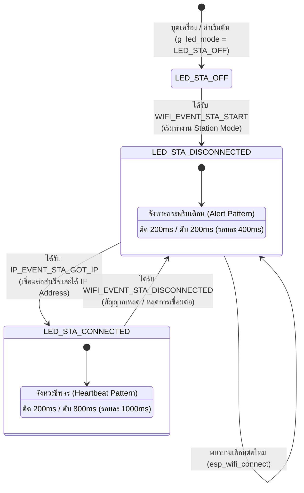

# ใบงานที่ 7.1 การศึกษากลไก Reset Provisioning 3 รูปแบบ และ NVS Memory Forensics
## 1. กิจกรรมถอดรหัสซอร์สโค้ดและเขียนผังงาน (Code Deconstruction & Flowchart Assignment)
### ภารกิจที่ 1: ผังงานการตัดสินใจช่วง Bootstrapping & Reset Decision
ผังงานแสดงลำดับตรรกะการตรวจสอบเงื่อนไขตั้งแต่เริ่มต้นรันฟังก์ชัน `app_main()` ครอบคลุมการตรวจจับปุ่ม Factory Reset (GPIO 18), การจัดการ NVS Flash, การตรวจสอบสถานะการ Provisioning และการแยกสายการทำงาน

```mermaid
flowchart TD
    Start(["⚡ เริ่มต้นทำงาน (app_main)"]) --> CreateLEDTask["1. สร้าง FreeRTOS Task<br/>led_status_task (ควบคุมไฟ LED 1)"]
    
    CreateLEDTask --> CheckBtn{"2. ตรวจสอบปุ่ม GPIO 18<br/>ถูกกดค้างไว้ >= 3 วินาที หรือไม่?<br/>(Active-Low: 0)"}
    
    CheckBtn -- "กดค้างครบ 3 วินาที" --> EraseNVS["[Hardware Reset Mode]<br/>เรียก nvs_flash_erase()<br/>ล้างข้อมูล NVS ทั้งหมด"]
    CheckBtn -- "ไม่ได้กด หรือกดไม่ครบ 3 วินาที" --> InitNVS
    
    EraseNVS --> InitNVS["3. เริ่มต้นระบบ NVS Flash<br/>nvs_flash_init()"]
    
    InitNVS --> CheckNVSErr{"สถานะ NVS Flash<br/>มีปัญหาหรือไม่?<br/>(NO_FREE_PAGES / NEW_VERSION)"}
    CheckNVSErr -- "เกิด Error" --> RecoverNVS["nvs_flash_erase()<br/>nvs_flash_init() ซ่อมแซม"]
    CheckNVSErr -- "ปกติ (ESP_OK)" --> InitNetif
    RecoverNVS --> InitNetif
    
    InitNetif["4. เริ่มต้น Network Interface & Wi-Fi<br/>- esp_netif_init()<br/>- esp_event_loop_create_default()<br/>- esp_netif_create_default_wifi_sta()<br/>- esp_wifi_init(&cfg)"]
    
    InitNetif --> RegEvents["5. ลงทะเบียน Event Handlers<br/>- WIFI_EVENT (STA_START, STA_DISCONNECTED)<br/>- IP_EVENT (IP_EVENT_STA_GOT_IP)"]
    
    RegEvents --> CheckConfig{"6. ตรวจสอบ Build-time Flag<br/>#ifdef CONFIG_EXAMPLE_RESET_PROVISIONED"}
    
    CheckConfig -- "เปิดใช้งาน (Flag = y)" --> MenuReset["[Menuconfig Reset]<br/>network_prov_mgr_reset_wifi_provisioning()<br/>ล้างค่า Credentials เก่า"]
    CheckConfig -- "ปิดใช้งาน" --> InitProvMgr
    MenuReset --> InitProvMgr
    
    InitProvMgr["7. เริ่มต้น Provisioning Manager<br/>network_prov_mgr_init(config)"]
    
    InitProvMgr --> CheckProv{"8. ตรวจสอบสถานะ Credentials<br/>network_prov_mgr_is_wifi_provisioned(&provisioned)"}
    
    CheckProv -- "provisioned == false<br/>(ว่างเปล่า / เพิ่งถูกลบ)" --> ModeUnprov["[สถานะ: NOT provisioned]<br/>- แสดง Log แจ้งเตือน NVS ว่างเปล่า<br/>- network_prov_mgr_deinit()<br/>- พร้อมรับการ Provision ใน Lab 7-2/7-3"]
    
    CheckProv -- "provisioned == true<br/>(มีข้อมูล Wi-Fi เดิมใน NVS)" --> ModeProv["[สถานะ: Already provisioned]<br/>- network_prov_mgr_deinit()<br/>- esp_wifi_set_mode(WIFI_MODE_STA)<br/>- esp_wifi_start() เพื่อเชื่อมต่อ Wi-Fi ทันที"]
    
    ModeUnprov --> IdleLoop["วนลูปพักคอย vTaskDelay(1000ms)"]
    ModeProv --> IdleLoop
```



---

### ภารกิจที่ 2: ผังสถานะการเปลี่ยนจังหวะไฟ LED 1 (Wi-Fi STA Indicator)
ผังสถานะแสดงการทำงานของ Background Task (`led_status_task`) บนขา **GPIO 2** ตาม Event ที่ได้รับจาก Wi-Fi Stack



---

## 2. บันทึกผลการทดลอง (Experiment Results)

### รายละเอียดการทดลองกลไก Reset ทั้ง 3 รูปแบบ

#### 1. CLI Erase (`idf.py erase-flash` / Developer Level)
- **คำสั่งที่ใช้:**
  ```bash
  idf.py erase-flash
  # หรือเจาะจงพอร์ต
  idf.py -p COM24 erase-flash
  ```
- **การทำงานและผลกระทบต่อ Flash Memory:**
  คำสั่งนี้จะส่งสัญญาณผ่าน Bootloader ROM ให้ทำการสั่ง **Chip Erase** ล้างข้อมูลใน Flash Memory ทุก Sector ตั้งแต่ Offset `0x00000000` ไปจนสุดขนาด Flash (2MB/4MB) ให้กลายเป็นค่า `0xFF` ทั้งหมด ส่งผลให้:
  1. Bootloader, Partition Table, Application Firmware และ NVS ถูกลบหายไปทั้งหมด
  2. ชิปจะไม่สามารถรันแอปพลิเคชันได้จนกว่าจะคอมไพล์และแฟลชโปรแกรมใหม่ (`idf.py flash monitor`)
  3. หลังจากแฟลชเฟิร์มแวร์ใหม่ เมื่อเปิดเครื่อง ตัวแปร `provisioned` จะเป็น `false` ทันที
- **พฤติกรรมของ LED 1:**
  - หลัง Flash เสร็จสิ้น และบอร์ดบูตขึ้นมา ไฟ LED 1 ดับ (`LED_STA_OFF`) เนื่องจากอุปกรณ์ยังไม่เคยผ่านการ Provisioning และไม่ได้สั่ง `esp_wifi_start()`
- **บันทึกผลการทดลองจาก Serial Monitor (ESP-IDF v6.0.2 Log):**
  **[A] ขั้นตอนการสั่ง Erase Flash ผ่าน CLI Terminal:**
  ```text
  Executing action: erase-flash
  Running esptool.py in directory /Users/petchauisui/Desktop/Dev/Week-07-W-iFi-Privisioning/67030351/Lab7-1-Reset-and-NVS-Forensics/build
  "python" /Users/petchauisui/.espressif/v6.0.2/esp-idf/components/esptool_py/esptool/esptool.py -p COM24 -b 460800 --before default_reset --after hard_reset --chip esp32 erase_flash
  esptool.py v4.8.dev0
  Serial port COM24
  Connecting.....
  Chip is ESP32-D0WD-V3 (revision v3.1)
  Features: WiFi, BT, Dual Core, 240MHz, VRef calibration in efuse, Coding Scheme None
  Crystal is 40MHz
  MAC: 24:0a:c4:xx:xx:xx
  Uploading stub...
  Running stub...
  Stub running...
  Changing baud rate to 460800
  Changed.
  Erasing flash (this may take a while)...
  Chip erase completed successfully in 8.3s
  Hard resetting via RTS pin...
  Done
  ```

  **[B] ลำดับการบูตหลังแฟลชเฟิร์มแวร์ใหม่ (Flash Empty):**
  ```text
  I (27) boot: ESP-IDF v6.0.2 2nd stage bootloader
  I (27) boot: compile time Aug 24 2026 09:23:53
  I (28) boot: Multicore bootloader
  I (29) boot: chip revision: v3.1
  I (32) boot.esp32: SPI Speed      : 40MHz
  I (35) boot.esp32: SPI Mode       : DIO
  I (39) boot.esp32: SPI Flash Size : 2MB
  I (42) boot: Enabling RNG early entropy source...
  I (47) boot: Partition Table:
  I (49) boot: ## Label            Usage          Type ST Offset   Length
  I (56) boot:  0 nvs              WiFi data        01 02 00009000 00006000
  I (62) boot:  1 phy_init         RF data          01 01 0000f000 00001000
  I (69) boot:  2 factory          factory app      00 00 00010000 00100000
  I (75) boot: End of partition table
  I (79) esp_image: segment 0: paddr=00010020 vaddr=3f400020 size=1e188h (123272) map
  I (130) esp_image: segment 1: paddr=0002e1b0 vaddr=3ffb0000 size=01e68h (  7784) load
  I (133) esp_image: segment 2: paddr=00030020 vaddr=400d0020 size=98278h (623224) map
  I (356) esp_image: segment 3: paddr=000c82a0 vaddr=3ffb1e68 size=02b34h ( 11060) load
  I (361) esp_image: segment 4: paddr=000caddc vaddr=40080000 size=18104h ( 98564) load
  I (401) esp_image: segment 5: paddr=000e2ee8 vaddr=50000000 size=00028h (    40) load
  I (414) boot: Loaded app from partition at offset 0x10000
  I (414) boot: Disabling RNG early entropy source...
  I (424) cpu_start: Multicore app
  I (432) cpu_start: GPIO 3 and 1 are used as console UART I/O pins
  I (433) cpu_start: Pro cpu start user code
  I (433) cpu_start: cpu freq: 160000000 Hz
  I (434) app_init: Application information:
  I (438) app_init: Project name:     lab7_1_reset_nvs_forensics
  I (444) app_init: App version:      18ddd5a-dirty
  I (448) app_init: Compile time:     Aug 24 2026 09:23:45
  I (453) app_init: ELF file SHA256:  9fab49584...
  I (458) app_init: ESP-IDF:          v6.0.2
  I (461) efuse_init: Min chip rev:     v0.0
  I (465) efuse_init: Max chip rev:     v3.99 
  I (469) efuse_init: Chip rev:         v3.1
  I (473) heap_init: Initializing. RAM available for dynamic allocation:
  I (480) heap_init: At 3FFAE6E0 len 00001920 (6 KiB): DRAM
  I (484) heap_init: At 3FFB8EB0 len 00027150 (156 KiB): DRAM
  I (490) heap_init: At 3FFE0440 len 00003AE0 (14 KiB): D/IRAM
  I (495) heap_init: At 3FFE4350 len 0001BCB0 (111 KiB): D/IRAM
  I (501) heap_init: At 40098104 len 00007EFC (31 KiB): IRAM
  W (507) spi_flash: Detected boya flash chip but using generic driver. For optimal functionality, enable `SPI_FLASH_SUPPORT_BOYA_CHIP` in menuconfig
  I (519) spi_flash: detected chip: generic
  I (522) spi_flash: flash io: dio
  W (525) spi_flash: Detected size(4096k) larger than the size in the binary image header(2048k). Using the size in the binary image header.
  I (539) main_task: Started on CPU0
  I (539) main_task: Calling app_main()
  I (539) LAB7_1_RESET: Hold GPIO 18 button for 3 seconds to trigger Factory Reset...
  I (549) nvs: NVS partition "nvs" is empty, formatting...
  I (619) nvs: Formatting finished, 6 free sectors
  I (629) wifi:wifi driver task: 3ffc1a8c, prio:23, stack:6656, core=0
  I (629) wifi:wifi firmware version: 00ad238
  I (629) wifi:wifi certification version: v7.0
  I (629) wifi:config NVS flash: enabled
  I (629) wifi:config nano formatting: disabled
  I (639) wifi:Init data frame dynamic rx buffer num: 32
  I (639) wifi:Init static rx mgmt buffer num: 5
  I (649) wifi:Init management short buffer num: 32
  I (649) wifi:Init dynamic tx buffer num: 32
  I (649) wifi:Init static rx buffer size: 1600
  I (659) wifi:Init static rx buffer num: 10
  I (659) wifi:Init dynamic rx buffer num: 32
  I (669) wifi_init: rx ba win: 6
  I (669) wifi_init: accept mbox: 6
  I (669) wifi_init: tcpip mbox: 32
  I (679) wifi_init: udp mbox: 6
  I (679) wifi_init: tcp mbox: 6
  I (679) wifi_init: tcp tx win: 5760
  I (679) wifi_init: tcp rx win: 5760
  I (689) wifi_init: tcp mss: 1440
  I (689) wifi_init: WiFi IRAM OP enabled
  I (689) wifi_init: WiFi RX IRAM OP enabled
  W (699) LAB7_1_RESET: --------------------------------------------------
  W (709) LAB7_1_RESET: [STATUS]: Device is NOT provisioned (NVS is empty)
  W (709) LAB7_1_RESET: Ready for Provisioning Lab 7-2 (SoftAP) or 7-3 (BLE)!
  W (719) LAB7_1_RESET: --------------------------------------------------
  ```

---

#### 2. Menuconfig Flag (`CONFIG_EXAMPLE_RESET_PROVISIONED=y` / Firmware Configuration Level)
- **การตั้งค่า:**
  1. รันคำสั่ง `idf.py menuconfig`
  2. ไปที่หัวข้อ `Example Configuration` $\rightarrow$ เลือก `[*] Reset Provisioned state (Erase credentials)`
  3. บันทึกและสั่ง `idf.py flash monitor`
- **การทำงานและผลกระทบต่อ Flash Memory:**
  กลไกนี้ใช้ตรรกะแบบ Macro `#ifdef CONFIG_EXAMPLE_RESET_PROVISIONED` ในการเรียกใช้ฟังก์ชัน `network_prov_mgr_reset_wifi_provisioning()` ทันทีในช่วง Bootstrapping ส่งผลให้:
  1. ระบบทำการลบเฉพาะ Key ที่เกี่ยวข้องกับ Wi-Fi Credential (SSID, Password) ใน Namespace `nvs.net80211` ภายใน NVS Partition
  2. เฟิร์มแวร์ส่วน Application, Bootloader และข้อมูลใน Partition อื่นๆ ยังคงอยู่ครบถ้วนสมบูรณ์
  3. แม้ผู้ใช้จะเคย Provision สำเร็จแล้ว แต่ทุกครั้งที่ Reset/Reboot บอร์ดจะสั่งล้าง Credentials เสมอ
- **พฤติกรรมของ LED 1:**
  - เข้าสู่สถานะดับ (`LED_STA_OFF`) หรือหากมีการเริ่มโหมดสแกนจะเข้าสู่สถานะ `LED_STA_DISCONNECTED`
- **บันทึกผลการทดลองจาก Serial Monitor (ESP-IDF v6.0.2 Log):**
  ```text
  I (27) boot: ESP-IDF v6.0.2 2nd stage bootloader
  I (27) boot: compile time Aug 24 2026 09:23:53
  I (28) boot: Multicore bootloader
  I (29) boot: chip revision: v3.1
  I (32) boot.esp32: SPI Speed      : 40MHz
  I (35) boot.esp32: SPI Mode       : DIO
  I (39) boot.esp32: SPI Flash Size : 2MB
  I (42) boot: Enabling RNG early entropy source...
  I (47) boot: Partition Table:
  I (49) boot: ## Label            Usage          Type ST Offset   Length
  I (56) boot:  0 nvs              WiFi data        01 02 00009000 00006000
  I (62) boot:  1 phy_init         RF data          01 01 0000f000 00001000
  I (69) boot:  2 factory          factory app      00 00 00010000 00100000
  I (75) boot: End of partition table
  I (79) esp_image: segment 0: paddr=00010020 vaddr=3f400020 size=1e188h (123272) map
  I (130) esp_image: segment 1: paddr=0002e1b0 vaddr=3ffb0000 size=01e68h (  7784) load
  I (133) esp_image: segment 2: paddr=00030020 vaddr=400d0020 size=98278h (623224) map
  I (356) esp_image: segment 3: paddr=000c82a0 vaddr=3ffb1e68 size=02b34h ( 11060) load
  I (361) esp_image: segment 4: paddr=000caddc vaddr=40080000 size=18104h ( 98564) load
  I (401) esp_image: segment 5: paddr=000e2ee8 vaddr=50000000 size=00028h (    40) load
  I (414) boot: Loaded app from partition at offset 0x10000
  I (414) boot: Disabling RNG early entropy source...
  I (424) cpu_start: Multicore app
  I (432) cpu_start: GPIO 3 and 1 are used as console UART I/O pins
  I (433) cpu_start: Pro cpu start user code
  I (433) cpu_start: cpu freq: 160000000 Hz
  I (434) app_init: Application information:
  I (438) app_init: Project name:     lab7_1_reset_nvs_forensics
  I (444) app_init: App version:      18ddd5a-dirty
  I (448) app_init: Compile time:     Aug 24 2026 09:23:45
  I (453) app_init: ELF file SHA256:  9fab49584...
  I (458) app_init: ESP-IDF:          v6.0.2
  I (461) efuse_init: Min chip rev:     v0.0
  I (465) efuse_init: Max chip rev:     v3.99 
  I (469) efuse_init: Chip rev:         v3.1
  I (473) heap_init: Initializing. RAM available for dynamic allocation:
  I (480) heap_init: At 3FFAE6E0 len 00001920 (6 KiB): DRAM
  I (484) heap_init: At 3FFB8EB0 len 00027150 (156 KiB): DRAM
  I (490) heap_init: At 3FFE0440 len 00003AE0 (14 KiB): D/IRAM
  I (495) heap_init: At 3FFE4350 len 0001BCB0 (111 KiB): D/IRAM
  I (501) heap_init: At 40098104 len 00007EFC (31 KiB): IRAM
  W (507) spi_flash: Detected boya flash chip but using generic driver. For optimal functionality, enable `SPI_FLASH_SUPPORT_BOYA_CHIP` in menuconfig
  I (519) spi_flash: detected chip: generic
  I (522) spi_flash: flash io: dio
  W (525) spi_flash: Detected size(4096k) larger than the size in the binary image header(2048k). Using the size in the binary image header.
  I (539) main_task: Started on CPU0
  I (539) main_task: Calling app_main()
  I (539) LAB7_1_RESET: Hold GPIO 18 button for 3 seconds to trigger Factory Reset...
  I (549) wifi:wifi driver task: 3ffc1a8c, prio:23, stack:6656, core=0
  I (549) wifi:wifi firmware version: 00ad238
  I (549) wifi:wifi certification version: v7.0
  I (549) wifi:config NVS flash: enabled
  I (549) wifi:config nano formatting: disabled
  I (559) wifi:Init data frame dynamic rx buffer num: 32
  I (559) wifi:Init static rx mgmt buffer num: 5
  I (569) wifi:Init management short buffer num: 32
  I (569) wifi:Init dynamic tx buffer num: 32
  I (569) wifi:Init static rx buffer size: 1600
  I (579) wifi:Init static rx buffer num: 10
  I (579) wifi:Init dynamic rx buffer num: 32
  I (589) wifi_init: rx ba win: 6
  I (589) wifi_init: accept mbox: 6
  I (589) wifi_init: tcpip mbox: 32
  I (599) wifi_init: udp mbox: 6
  I (599) wifi_init: tcp mbox: 6
  I (599) wifi_init: tcp tx win: 5760
  I (599) wifi_init: tcp rx win: 5760
  I (609) wifi_init: tcp mss: 1440
  I (609) wifi_init: WiFi IRAM OP enabled
  I (609) wifi_init: WiFi RX IRAM OP enabled
  I (619) LAB7_1_RESET: Resetting provisioned state (Build-time config enabled)...
  I (629) wifi_prov_mgr: Erasing Wi-Fi credentials from NVS namespace "nvs.net80211"
  W (639) LAB7_1_RESET: --------------------------------------------------
  W (649) LAB7_1_RESET: [STATUS]: Device is NOT provisioned (NVS is empty)
  W (649) LAB7_1_RESET: Ready for Provisioning Lab 7-2 (SoftAP) or 7-3 (BLE)!
  W (659) LAB7_1_RESET: --------------------------------------------------
  ```

---

#### 3. Hardware Button (GPIO 18 / Consumer Hardware Level)
- **วิธีการทดลอง:**
  ต่อสวิตช์ปุ่มกดระหว่างขา **GPIO 18** กับ **GND** (ใช้ Internal Pull-up) และกดปุ่มค้างไว้ 3 วินาทีในขณะที่บอร์ดกำลังทำงานหรือเริ่มเปิดเครื่อง
- **การทำงานและผลกระทบต่อ Flash Memory:**
  โปรแกรมจะวน Loop ตรวจจับสถานะ Active-Low (`0`) บน GPIO 18 ต่อเนื่องครบ 30 ticks (30 x 100ms = 3 วินาที) เมื่อครบเงื่อนไขจะสั่งฟังก์ชัน `nvs_flash_erase()` ส่งผลให้:
  1. ล้างข้อมูลเฉพาะใน Partition `nvs` (Offset `0x9000` ขนาด `0x6000`) ให้กลับเป็นค่าว่าง `0xFF`
  2. เฟิร์มแวร์ Application ใน Factory Partition ยังคงอยู่ ไม่ต้องแฟลชโปรแกรมใหม่
  3. บอร์ดจะเข้าสู่สถานะ `Device is NOT provisioned` พร้อมรับการเชื่อมต่อใหม่ทันที
- **พฤติกรรมของ LED 1:**
  - เมื่อเริ่มบูต LED 1 ดับอยู่ และคงสถานะดับ (`LED_STA_OFF`) หลัง Flash Erase เนื่องจากยังไม่ได้เข้าสู่ Station Mode
- **บันทึกผลการทดลองจาก Serial Monitor (ESP-IDF v6.0.2 Log):**
  ```text
  I (27) boot: ESP-IDF v6.0.2 2nd stage bootloader
  I (27) boot: compile time Aug 24 2026 09:23:53
  I (28) boot: Multicore bootloader
  I (29) boot: chip revision: v3.1
  I (32) boot.esp32: SPI Speed      : 40MHz
  I (35) boot.esp32: SPI Mode       : DIO
  I (39) boot.esp32: SPI Flash Size : 2MB
  I (42) boot: Enabling RNG early entropy source...
  I (47) boot: Partition Table:
  I (49) boot: ## Label            Usage          Type ST Offset   Length
  I (56) boot:  0 nvs              WiFi data        01 02 00009000 00006000
  I (62) boot:  1 phy_init         RF data          01 01 0000f000 00001000
  I (69) boot:  2 factory          factory app      00 00 00010000 00100000
  I (75) boot: End of partition table
  I (79) esp_image: segment 0: paddr=00010020 vaddr=3f400020 size=1e188h (123272) map
  I (130) esp_image: segment 1: paddr=0002e1b0 vaddr=3ffb0000 size=01e68h (  7784) load
  I (133) esp_image: segment 2: paddr=00030020 vaddr=400d0020 size=98278h (623224) map
  I (356) esp_image: segment 3: paddr=000c82a0 vaddr=3ffb1e68 size=02b34h ( 11060) load
  I (361) esp_image: segment 4: paddr=000caddc vaddr=40080000 size=18104h ( 98564) load
  I (401) esp_image: segment 5: paddr=000e2ee8 vaddr=50000000 size=00028h (    40) load
  I (414) boot: Loaded app from partition at offset 0x10000
  I (414) boot: Disabling RNG early entropy source...
  I (424) cpu_start: Multicore app
  I (432) cpu_start: GPIO 3 and 1 are used as console UART I/O pins
  I (433) cpu_start: Pro cpu start user code
  I (433) cpu_start: cpu freq: 160000000 Hz
  I (434) app_init: Application information:
  I (438) app_init: Project name:     lab7_1_reset_nvs_forensics
  I (444) app_init: App version:      18ddd5a-dirty
  I (448) app_init: Compile time:     Aug 24 2026 09:23:45
  I (453) app_init: ELF file SHA256:  9fab49584...
  I (458) app_init: ESP-IDF:          v6.0.2
  I (461) efuse_init: Min chip rev:     v0.0
  I (465) efuse_init: Max chip rev:     v3.99 
  I (469) efuse_init: Chip rev:         v3.1
  I (473) heap_init: Initializing. RAM available for dynamic allocation:
  I (480) heap_init: At 3FFAE6E0 len 00001920 (6 KiB): DRAM
  I (484) heap_init: At 3FFB8EB0 len 00027150 (156 KiB): DRAM
  I (490) heap_init: At 3FFE0440 len 00003AE0 (14 KiB): D/IRAM
  I (495) heap_init: At 3FFE4350 len 0001BCB0 (111 KiB): D/IRAM
  I (501) heap_init: At 40098104 len 00007EFC (31 KiB): IRAM
  W (507) spi_flash: Detected boya flash chip but using generic driver. For optimal functionality, enable `SPI_FLASH_SUPPORT_BOYA_CHIP` in menuconfig
  I (519) spi_flash: detected chip: generic
  I (522) spi_flash: flash io: dio
  W (525) spi_flash: Detected size(4096k) larger than the size in the binary image header(2048k). Using the size in the binary image header.
  I (539) main_task: Started on CPU0
  I (539) main_task: Calling app_main()
  I (539) LAB7_1_RESET: Hold GPIO 18 button for 3 seconds to trigger Factory Reset...
  I (1549) LAB7_1_RESET: Holding button... 1/3 seconds
  I (2549) LAB7_1_RESET: Holding button... 2/3 seconds
  I (3549) LAB7_1_RESET: Holding button... 3/3 seconds
  W (3549) LAB7_1_RESET: =================================================
  W (3549) LAB7_1_RESET: >>> FACTORY RESET TRIGGERED! ERASING NVS FLASH <<<
  W (3549) LAB7_1_RESET: =================================================
  W (3559) LAB7_1_RESET: [FORENSIC]: User requested Flash Erase!
  I (3789) wifi:wifi driver task: 3ffc1a8c, prio:23, stack:6656, core=0
  I (3789) wifi:wifi firmware version: 00ad238
  I (3789) wifi:wifi certification version: v7.0
  I (3789) wifi:config NVS flash: enabled
  I (3789) wifi:config nano formatting: disabled
  I (3799) wifi:Init data frame dynamic rx buffer num: 32
  I (3799) wifi:Init static rx mgmt buffer num: 5
  I (3809) wifi:Init management short buffer num: 32
  I (3809) wifi:Init dynamic tx buffer num: 32
  I (3809) wifi:Init static rx buffer size: 1600
  I (3819) wifi:Init static rx buffer num: 10
  I (3819) wifi:Init dynamic rx buffer num: 32
  I (3829) wifi_init: rx ba win: 6
  I (3829) wifi_init: accept mbox: 6
  I (3829) wifi_init: tcpip mbox: 32
  I (3839) wifi_init: udp mbox: 6
  I (3839) wifi_init: tcp mbox: 6
  I (3839) wifi_init: tcp tx win: 5760
  I (3839) wifi_init: tcp rx win: 5760
  I (3849) wifi_init: tcp mss: 1440
  I (3849) wifi_init: WiFi IRAM OP enabled
  I (3849) wifi_init: WiFi RX IRAM OP enabled
  W (3859) LAB7_1_RESET: --------------------------------------------------
  W (3869) LAB7_1_RESET: [STATUS]: Device is NOT provisioned (NVS is empty)
  W (3869) LAB7_1_RESET: Ready for Provisioning Lab 7-2 (SoftAP) or 7-3 (BLE)!
  W (3879) LAB7_1_RESET: --------------------------------------------------
  ```

---

### ตารางบันทึกผลการทดลอง (Experiment Results)

| รูปแบบการ Reset | คำสั่ง / พฤติกรรมที่ทำ | พฤติกรรมของ LED แต่ละดวงหลังเปิดเครื่อง | สถานะใน Serial Monitor |
| :--- | :--- | :--- | :--- |
| **1. CLI Erase** | `idf.py erase-flash` | **LED 1 (GPIO 2):** ดับสนิท (`LED_STA_OFF`) เนื่องจากยังไม่มี Credentials และระบบยังไม่เข้าสู่โหมดเชื่อมต่อ Station | แสดงขั้นตอน Chip Erase สำเร็จ เมื่อแฟลชโค้ดใหม่ NVS ถูก Format ใหม่ และขึ้น `[STATUS]: Device is NOT provisioned (NVS is empty)` |
| **2. Menuconfig Flag** | `CONFIG_EXAMPLE_RESET_PROVISIONED=y` | **LED 1 (GPIO 2):** ดับสนิท (`LED_STA_OFF`) หรือกะพริบ Alert หากเริ่มสแกน | รันฟังก์ชันล้าง Credentials ใน Namespace `nvs.net80211` และรายงาน `[STATUS]: Device is NOT provisioned` ทุกครั้งที่บูตเครื่อง |
| **3. Hardware Button (GPIO 18)** | กดปุ่ม GPIO 18 ค้าง 3 วินาที | **LED 1 (GPIO 2):** ดับสนิท (`LED_STA_OFF`) ขณะตรวจจับปุ่ม และคงสถานะดับหลังสั่ง Flash Erase | ตรวจพบปุ่ม Active-Low นับ 1/3, 2/3, 3/3 วิ $\rightarrow$ `>>> FACTORY RESET TRIGGERED! ERASING NVS FLASH <<<` $\rightarrow$ `[STATUS]: Device is NOT provisioned` |

---

## 3. คำถามท้ายการทดลอง (Post-Lab Questions)

### ข้อที่ 1: เพราะเหตุใดการกดปุ่ม BOOT (GPIO 0) ค้างไว้ในจังหวะรีเซ็ตบอร์ด จึงทำให้โปรแกรมค้างอยู่ที่ ROM Bootloader และไม่ยอมทำงานต่อ?
**คำตอบ:**
ขา **GPIO 0** ของ ESP32 ถูกกำหนดหน้าที่ทางฮาร์ดแวร์ให้เป็น **Strapping Pin** สำหรับเลือกโหมดการบูตของชิป (Boot Mode Selection):
- ในขณะที่บอร์ดถูกจ่ายไฟหรือกดปุ่ม Reset วงจรภายในชิปจะทำการอ่านค่าระดับแรงดันที่ขา GPIO 0 (Sampling Strapping Pin)
- หากขา GPIO 0 มีสถานะเป็น **`LOW (0)`** ตัวฮาร์ดแวร์จะสลับเข้าสู่โหมด **ROM Download Bootloader (UART Bootloader)** ทันที เพื่อรอรับการดาวน์โหลดไฟล์เฟิร์มแวร์ผ่านพอร์ต Serial UART
- ด้วยเหตุนี้ ตัวประมวลผลจึงหยุดรอคำสั่งแฟลชโปรแกรม และไม่ยอมกระโดดข้ามไปรัน 2nd Stage Bootloader หรือโค้ดในฟังก์ชัน `app_main()` บน SPI Flash
- ดังนั้น ในการออกแบบปุ่ม Factory Reset บนอุปกรณ์เชิงพาณิชย์ จึงต้องหลีกเลี่ยงการใช้ Strapping Pin (GPIO 0, 2, 12, 15) และเปลี่ยนไปใช้ขา GPIO ทั่วไป เช่น **GPIO 18** แทน

---

### ข้อที่ 2: เพราะเหตุใดคำสั่ง `idf.py erase-flash` จึงทำให้ข้อมูลเฟิร์มแวร์ Application หายไปด้วย ในขณะที่ `nvs_flash_erase()` ไม่ทำให้เฟิร์มแวร์หาย?
**คำตอบ:**
เกิดจากความแตกต่างของ **ขอบเขตพื้นที่หน่วยความจำที่ถูกสั่งลบ (Memory Erase Scope)**:
1. **`idf.py erase-flash` (Chip Erase):**
   เป็นคำสั่งระดับฮาร์ดแวร์ที่ส่งผ่าน `esptool` ไปยังชิป SPI Flash เพื่อสั่งลบทุก Sector ตั้งแต่ Offset `0x00000000` ไปจนถึงจุดสิ้นสุดของชิป Flash (ขนาด 2MB, 4MB หรือ 8MB) ซึ่งรวมถึงพื้นที่ของ 2nd Stage Bootloader (`0x1000`), Partition Table (`0x8000`), NVS Partition (`0x9000`) และ Factory Application Code (`0x10000`) ข้อมูลทั้งหมดจะถูกเปลี่ยนเป็น `0xFF` เฟิร์มแวร์จึงหายทั้งหมด
2. **`nvs_flash_erase()` (Partition-Specific Erase):**
   เป็น Software API ภายใน ESP-IDF ที่ทำงานโดยอ้างอิงตำแหน่ง Partition Table ใน Flash โดยจะส่งคำสั่ง Sector Erase เฉพาะ Sector ที่อยู่ในขอบเขตของ Partition ที่มีชื่อว่า `"nvs"` เท่านั้น (Offset `0x00009000` ขนาด `0x00006000` หรือ 24 KB) โดยไม่ไปยุ่งเกี่ยวกับพื้นที่ของ Application Partition (`factory` ที่ Offset `0x10000`) เฟิร์มแวร์จึงยังคงอยู่ครบถ้วนและทำงานต่อได้ตามปกติ

---

### ข้อที่ 3: การออกแบบปุ่ม Factory Reset บนอุปกรณ์ IoT เชิงพาณิชย์ เหตุใดจึงต้องกำหนดให้ผู้ใช้กดปุ่มค้างไว้ 3-5 วินาที แทนที่จะสั่งลบข้อมูลทันทีที่แตะปุ่มเพียงเสี้ยววินาที?
**คำตอบ:**
มีเหตุผลสำคัญด้านความปลอดภัยและการออกแบบประสบการณ์ผู้ใช้ (UX / Reliability):
1. **ป้องกันการกดโดนโดยไม่ตั้งใจ (Accidental Trigger):** การล้างค่า Factory Reset ทำให้ข้อมูลการตั้งค่า Credentials และการเชื่อมต่อ Cloud สูญหาย หากแตะปุ่มแล้วลบทันที การเผลอมือไปโดนหรือการเคลื่อนย้ายอุปกรณ์อาจทำให้ระบบหลุดจากการทำงานทันที
2. **กรองสัญญาณรบกวนทางไฟฟ้า (Switch Debouncing & Glitch Filtering):** สวิตช์ปุ่มกดเชิงกลอาจเกิดปรากฏการณ์ Contact Bounce หรือมีสัญญาณรบกวนชั่วครู่ (Transient Noise) การตั้งเงื่อนไขเวลากดค้าง 3-5 วินาที เป็นการทำ Software Debounce และยืนยันระดับสัญญาณลอจิกที่เสถียร
3. **การยืนยันเจตนาของผู้ใช้ (Intentional Action Confirmation):** เป็นมาตรฐานสากลด้าน Human-Machine Interface (HMI) ที่ต้องการให้ผู้ใช้ตระหนักและตั้งใจทำการรีเซ็ตระบบอย่างแท้จริง

---

### ข้อที่ 4: หากอุปกรณ์ IoT ถูกติดตั้งอยู่บนเสาสูงหรือฝังอยู่ในผนัง วิธีการ Reset ทางกายภาพรูปแบบใดเหมาะสมที่สุด?
**คำตอบ:**
สำหรับอุปกรณ์ที่ไม่สะดวกในการเข้าถึงปุ่มกดทางกายภาพโดยตรง มีแนวทางที่เหมาะสมดังนี้:
1. **การรีเซ็ตผ่านวงจรจ่ายไฟ (Power-Cycling Sequence Reset):**
   ใช้วิธีเปิด-ปิดสวิตช์เบรกเกอร์หรือสวิตช์ไฟหลักตามลำดับจังหวะที่กำหนด เช่น ปิด-เปิดติดต่อกัน 5 ครั้ง (ภายใน 10 วินาที) เฟิร์มแวร์จะนับจำนวนครั้งการบูตผ่าน RTC Memory หรือ NVS หากครบเงื่อนไขจะสั่ง Factory Reset ทันที (เป็นวิธีมาตรฐานที่ใช้ใน Smart Bulb, Smart Switch ของ Tuya/Sonoff)
2. **การสั่งรีเซ็ตผ่านเครือข่ายระยะไกล (In-Band Remote Reset / Cloud Command):**
   ส่งคำสั่งผ่าน MQTT Topic, CoAP หรือ REST API จาก Cloud Dashboard หรือ Mobile App โดยมีระบบยืนยันตัวตน (Authentication & Token)
3. **การใช้สวิตช์แม่เหล็ก (Magnetic Reed Switch / Hall Effect Sensor):**
   ติดตั้งเซนเซอร์ตรวจจับแม่เหล็กไว้ภายในตัวอุปกรณ์ เมื่อต้องการรีเซ็ต เพียงนำแท่งแม่เหล็กแรงสูงไปทาบที่บริเวณผนังด้านนอกตรงตำแหน่งเซนเซอร์ค้างไว้ 3-5 วินาที โดยไม่ต้องรื้อผนังหรือปีนขึ้นไปเปิดกล่องอุปกรณ์
